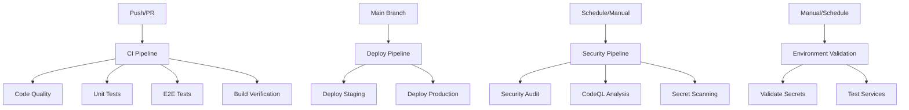

# CI/CD Pipeline Documentation

## 🚀 Pipeline Status


[](https://codecov.io/gh/YOUR_USERNAME/mexc-sniper-bot)
[](LICENSE.md)
[](https://vercel.com)

## 📋 Overview

This project uses a comprehensive CI/CD pipeline built with GitHub Actions and Vercel for automated testing, security scanning, and deployment. The pipeline ensures code quality, security, and reliable deployments across multiple environments.

## 🏗️ Pipeline Architecture



## 🔄 Workflows

### 1. CI Pipeline (`ci.yml`)
**Triggers:** Push to main/develop, Pull requests
**Purpose:** Comprehensive testing and quality assurance

**Jobs:**
- **Code Quality & Security**
  - Linting with Biome
  - Format checking
  - TypeScript type checking
  - Dependency security audit

- **Unit & Integration Tests**
  - Vitest test suites
  - Coverage reporting
  - Upload to Codecov

- **End-to-End Tests**
  - Playwright E2E tests
  - Cross-browser testing
  - Test artifact collection

- **Build Verification**
  - Next.js production build
  - Bundle analysis
  - Build artifact storage

- **Performance Tests** (push only)
  - Performance benchmarks
  - Memory usage analysis

### 2. Deploy Pipeline (`deploy.yml`)
**Triggers:** Push to main, Pull requests
**Purpose:** Automated deployment to staging and production

**Jobs:**
- **Deploy Staging** (PR only)
  - Vercel preview deployment
  - Deployment validation tests
  - PR comment with preview URL

- **Deploy Production** (main branch)
  - Pre-deployment quality checks
  - Vercel production deployment
  - Production validation tests
  - Automated issue creation for status

- **Emergency Rollback** (manual trigger)
  - Quick rollback to previous version
  - Incident notification

### 3. Security Pipeline (`security.yml`)
**Triggers:** Daily schedule, Push, Pull requests, Manual
**Purpose:** Comprehensive security monitoring

**Jobs:**
- **Security Audit**
  - Dependency vulnerability scanning
  - High/critical vulnerability detection

- **Dependency Review** (PR only)
  - Review new dependencies
  - License compliance checking

- **CodeQL Analysis**
  - Static code analysis
  - Security vulnerability detection
  - SARIF report generation

- **Secret Scanning**
  - TruffleHog OSS scanning
  - Credential leak detection

- **License Compliance**
  - License checking
  - Compliance reporting

- **OSSF Security Scorecard**
  - Security posture assessment
  - Best practices validation

### 4. Release Pipeline (`release.yml`)
**Triggers:** Git tags, Manual workflow dispatch
**Purpose:** Automated release management

**Jobs:**
- **Validate Release**
  - Full test suite execution
  - Security audit
  - Build verification

- **Create Release**
  - Automated changelog generation
  - GitHub release creation
  - Release asset upload

- **Deploy Release**
  - Production deployment
  - Release notification

- **Post-Release Tasks**
  - Team notification
  - Monitoring setup
  - Issue creation for tracking

### 5. Environment Validation (`environment-validation.yml`)
**Triggers:** Weekly schedule, Manual
**Purpose:** Environment health monitoring

**Jobs:**
- **Validate Secrets**
  - GitHub secrets verification
  - Missing secret detection

- **Validate Vercel Environment**
  - Environment variable checking
  - Configuration validation

- **Test Database Connectivity**
  - Database connection testing
  - Migration validation

- **Test External Services**
  - MEXC API connectivity
  - OpenAI API validation
  - Kinde authentication testing

- **Health Report Generation**
  - Comprehensive status report
  - Automated issue creation

## 🔧 Configuration

### GitHub Secrets Required
| Secret | Purpose | Where to Get |
|--------|---------|--------------|
| `VERCEL_TOKEN` | Vercel deployment | [Vercel Dashboard](https://vercel.com/account/tokens) |
| `VERCEL_ORG_ID` | Vercel organization | `.vercel/project.json` |
| `VERCEL_PROJECT_ID` | Vercel project | `.vercel/project.json` |
| `DATABASE_URL` | Database connection | NeonDB dashboard |
| `MEXC_API_KEY` | Trading API | MEXC platform |
| `MEXC_SECRET_KEY` | Trading API | MEXC platform |
| `OPENAI_API_KEY` | AI services | OpenAI platform |
| `KINDE_CLIENT_ID` | Authentication | Kinde dashboard |
| `KINDE_CLIENT_SECRET` | Authentication | Kinde dashboard |
| `KINDE_ISSUER_URL` | Authentication | Kinde dashboard |
| `NEXTAUTH_SECRET` | Session encryption | Generate random string |

### Vercel Environment Variables
Configure these in Vercel dashboard for each environment:
- Development: Local development values
- Preview: Staging/testing values  
- Production: Live production values

See [`.github/SECRETS_SETUP.md`](.github/SECRETS_SETUP.md) for detailed setup instructions.

## 🚀 Deployment Process

### Staging Deployment (Pull Requests)
1. PR created/updated → CI pipeline runs
2. All tests pass → Staging deployment triggered
3. Vercel creates preview deployment
4. Validation tests run against preview
5. PR comment added with preview URL

### Production Deployment (Main Branch)
1. Code merged to main → Deploy pipeline triggered
2. Pre-deployment checks run
3. Production build created
4. Deployed to Vercel production
5. Production validation tests
6. Success/failure issue created

### Release Deployment (Tags)
1. Tag pushed → Release pipeline triggered
2. Full validation suite runs
3. GitHub release created with changelog
4. Production deployment
5. Release notification sent

## 🔒 Security Features

### Automated Security Scanning
- **Daily dependency audits** with vulnerability detection
- **CodeQL static analysis** for security issues
- **Secret scanning** to prevent credential leaks
- **License compliance** checking
- **OSSF Security Scorecard** assessment

### Security Response
- Automated issue creation for security alerts
- High/critical vulnerability blocking
- Security team notifications
- Rollback capabilities for security incidents

## 📊 Monitoring & Reporting

### Continuous Monitoring
- **Code coverage** tracking with Codecov
- **Build performance** metrics
- **Test execution** monitoring
- **Deployment success** rates
- **Security posture** assessment

### Automated Reporting
- **CI/CD status** badges in README
- **Security alerts** via issues
- **Deployment notifications** 
- **Performance benchmarks**
- **Environment health** reports

## 🛠️ Development Workflow

### For Contributors
1. **Fork** the repository
2. **Create feature branch** from `develop`
3. **Make changes** with proper tests
4. **Run local checks** (`bun run pre-commit`)
5. **Create pull request** to `develop`
6. **Review CI results** and fix any issues
7. **Merge** after approval and passing CI

### For Maintainers
1. **Review and merge** PRs to `develop`
2. **Test staging** deployment thoroughly
3. **Merge develop** to `main` for production
4. **Create release tag** for versioned releases
5. **Monitor** deployment and application health

## 🚨 Troubleshooting

### Common Issues

**CI Pipeline Failures**
```bash
# Check logs in GitHub Actions
# Common fixes:
- Update dependencies: bun update
- Fix linting: bun run lint
- Fix type errors: bun run type-check
- Update tests: bun run test
```

**Deployment Failures**
```bash
# Check Vercel deployment logs
# Common fixes:
- Verify environment variables
- Check build configuration
- Validate secret access
- Review API limits
```

**Security Scan Failures**
```bash
# Update vulnerable dependencies
bun update
bun audit

# Fix security issues
bun audit fix
```

### Getting Help
- Check [GitHub Actions logs](../../actions) for detailed error messages
- Review [Vercel dashboard](https://vercel.com) for deployment issues
- Create an issue with error details and steps to reproduce
- Contact the development team for urgent production issues

## 📈 Performance Metrics

The CI/CD pipeline tracks several key metrics:

- **Build Time**: Target < 5 minutes
- **Test Coverage**: Target > 80%
- **Security Score**: Target > 8/10
- **Deployment Time**: Target < 3 minutes
- **Success Rate**: Target > 95%

## 🔄 Pipeline Maintenance

### Regular Tasks
- **Weekly**: Review security alerts and dependency updates
- **Monthly**: Audit and rotate API keys
- **Quarterly**: Review and update CI/CD configurations
- **Annually**: Major framework and tool updates

### Optimization
- Monitor pipeline performance and optimize slow jobs
- Update GitHub Actions to latest versions
- Review and consolidate workflows as needed
- Implement new security best practices

---

## 📞 Support

For CI/CD pipeline support:
- **Documentation**: This file and [SECRETS_SETUP.md](.github/SECRETS_SETUP.md)
- **Issues**: Create GitHub issue with `ci-cd` label
- **Urgent**: Contact @devops-team or @repository-admins
- **Improvements**: Submit PR with proposed changes

Built with ❤️ using GitHub Actions and Vercel