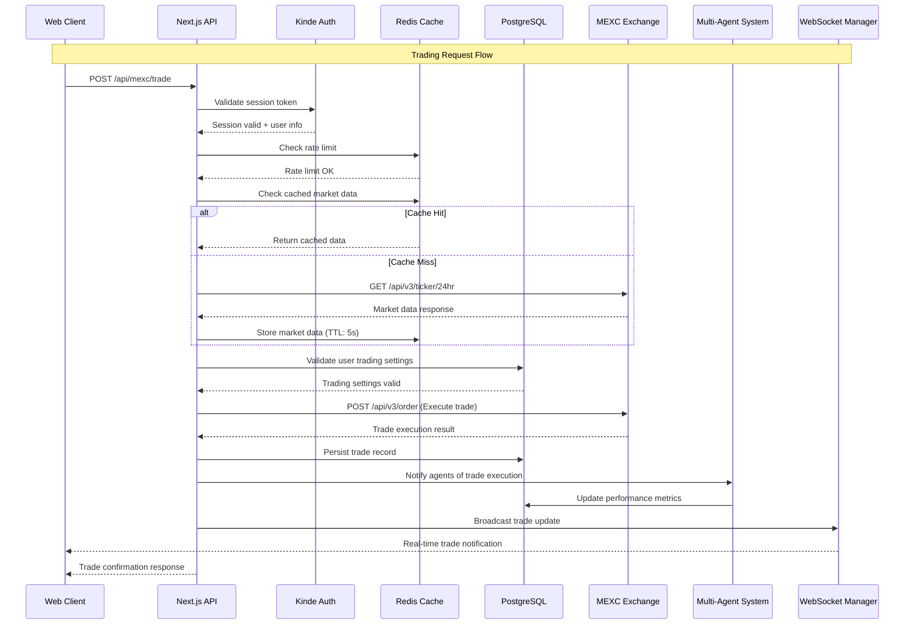
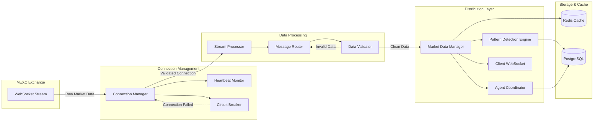
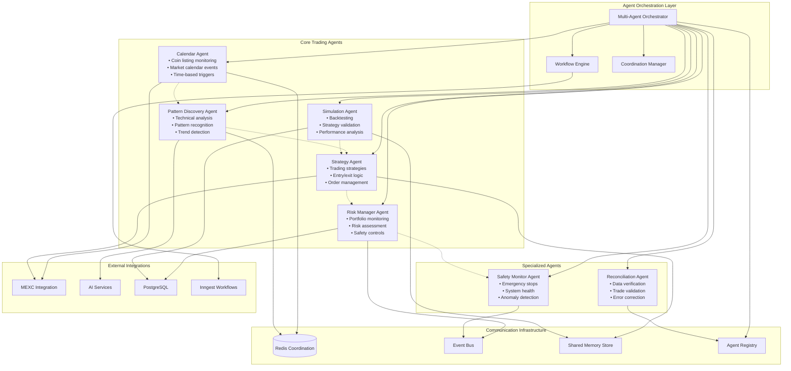
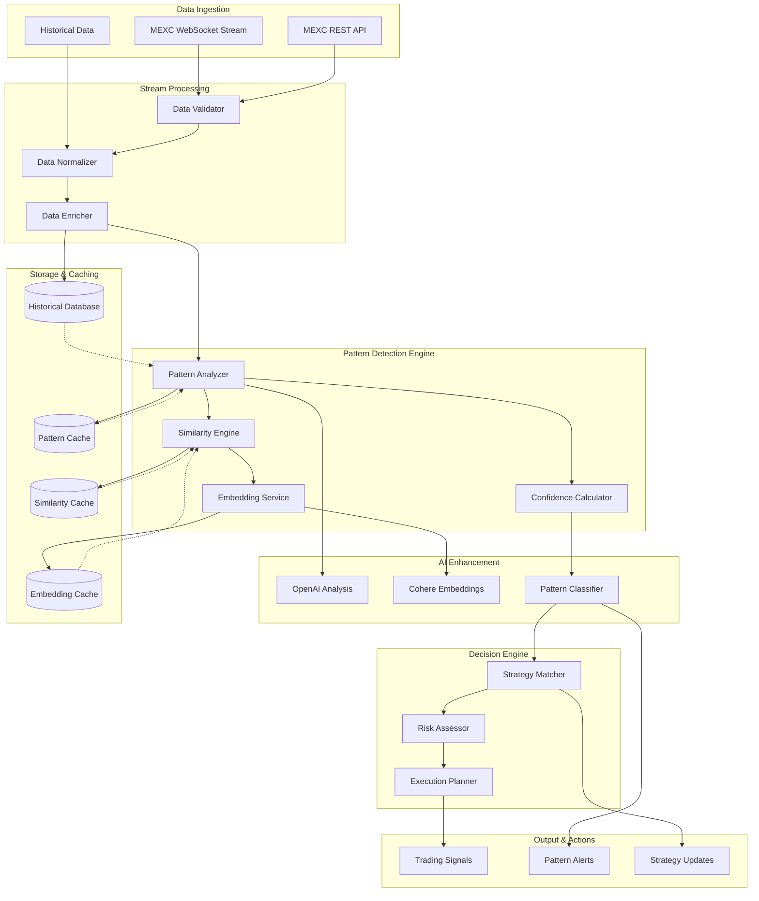
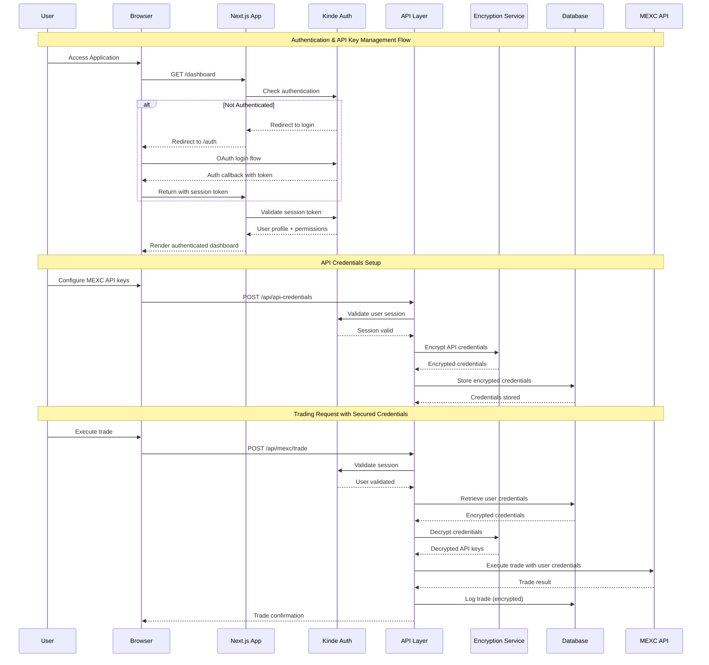
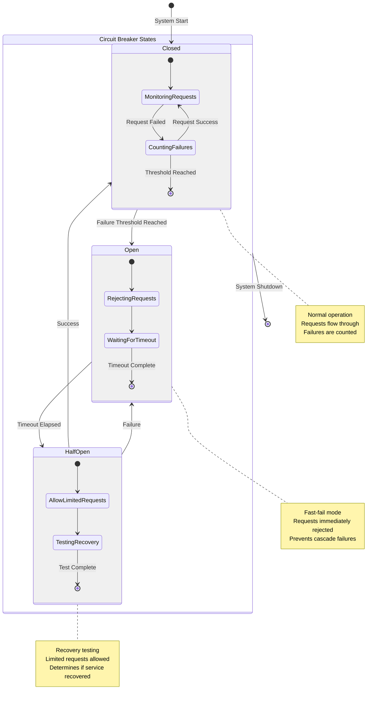
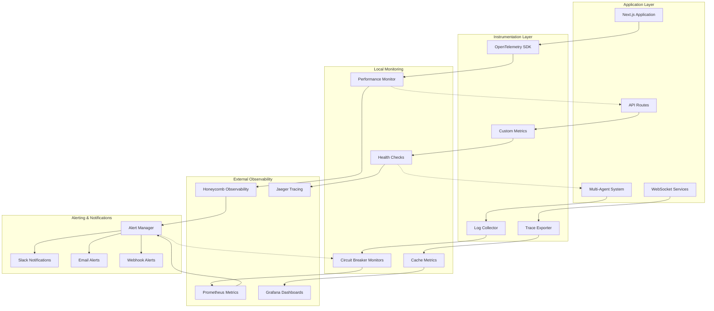
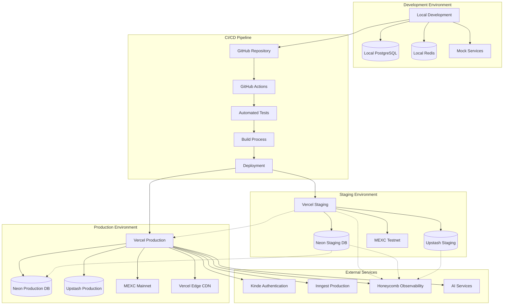

# Integration Architecture Diagrams - MEXC Sniper Bot

## Overview
This document provides detailed visual representations of the integration architecture for the MEXC Sniper Bot platform, including all external API integrations, service communication patterns, and data flow diagrams.

## 1. Complete System Integration Overview

```mermaid
graph TB
    subgraph "Client Layer"
        WEB[Web Browser]
        MOBILE[Mobile App]
    end
    
    subgraph "MEXC Sniper Bot Platform"
        subgraph "API Gateway"
            NEXTJS[Next.js API Routes]
            AUTH_MW[Auth Middleware]
            RATE_LMT[Rate Limiter]
        end
        
        subgraph "Service Layer"
            MEXC_SVC[MEXC Service Layer]
            AGENT_ORCH[Agent Orchestrator]
            PATTERN_SVC[Pattern Detection]
            RISK_SVC[Risk Management]
            TRADE_SVC[Trading Service]
        end
        
        subgraph "Data Layer"
            CACHE[Redis Cache]
            DB[PostgreSQL DB]
            WS_MGR[WebSocket Manager]
        end
        
        subgraph "Multi-Agent System"
            CAL_AGENT[Calendar Agent]
            PAT_AGENT[Pattern Agent]
            RISK_AGENT[Risk Agent]
            STRAT_AGENT[Strategy Agent]
            SIM_AGENT[Simulation Agent]
        end
    end
    
    subgraph "External Services"
        subgraph "Trading Exchange"
            MEXC_API[MEXC REST API]
            MEXC_WS[MEXC WebSocket]
        end
        
        subgraph "Authentication"
            KINDE[Kinde Auth Service]
        end
        
        subgraph "Database Services"
            NEON[Neon PostgreSQL]
            UPSTASH[Upstash Redis]
        end
        
        subgraph "AI Services"
            OPENAI[OpenAI API]
            ANTHROPIC[Anthropic Claude]
            PERPLEXITY[Perplexity API]
            COHERE[Cohere API]
        end
        
        subgraph "Workflow & Monitoring"
            INNGEST[Inngest Workflows]
            HONEYCOMB[Honeycomb Observability]
        end
    end
    
    %% Client Connections
    WEB --> NEXTJS
    MOBILE --> NEXTJS
    
    %% API Gateway Flow
    NEXTJS --> AUTH_MW
    AUTH_MW --> RATE_LMT
    RATE_LMT --> MEXC_SVC
    RATE_LMT --> AGENT_ORCH
    
    %% Service Layer Connections
    MEXC_SVC --> PATTERN_SVC
    MEXC_SVC --> RISK_SVC
    MEXC_SVC --> TRADE_SVC
    AGENT_ORCH --> CAL_AGENT
    AGENT_ORCH --> PAT_AGENT
    AGENT_ORCH --> RISK_AGENT
    AGENT_ORCH --> STRAT_AGENT
    AGENT_ORCH --> SIM_AGENT
    
    %% Data Layer Connections
    MEXC_SVC --> CACHE
    MEXC_SVC --> DB
    MEXC_SVC --> WS_MGR
    AGENT_ORCH --> CACHE
    AGENT_ORCH --> DB
    
    %% External Service Connections
    MEXC_SVC --> MEXC_API
    WS_MGR --> MEXC_WS
    AUTH_MW --> KINDE
    DB --> NEON
    CACHE --> UPSTASH
    PAT_AGENT --> OPENAI
    PAT_AGENT --> ANTHROPIC
    CAL_AGENT --> PERPLEXITY
    PATTERN_SVC --> COHERE
    AGENT_ORCH --> INNGEST
    MEXC_SVC --> HONEYCOMB
    
    %% Styling
    classDef external fill:#e1f5fe
    classDef internal fill:#f3e5f5
    classDef agent fill:#e8f5e8
    
    class MEXC_API,MEXC_WS,KINDE,NEON,UPSTASH,OPENAI,ANTHROPIC,PERPLEXITY,COHERE,INNGEST,HONEYCOMB external
    class NEXTJS,AUTH_MW,RATE_LMT,MEXC_SVC,PATTERN_SVC,RISK_SVC,TRADE_SVC,CACHE,DB,WS_MGR internal
    class CAL_AGENT,PAT_AGENT,RISK_AGENT,STRAT_AGENT,SIM_AGENT,AGENT_ORCH agent
```

## 2. API Integration Flow Diagram

## 3. WebSocket Real-Time Communication

## 4. Multi-Agent Communication Architecture

## 5. Data Flow and Pattern Detection Pipeline

## 6. Security and Authentication Flow

## 7. Error Handling and Circuit Breaker Pattern

## 8. Monitoring and Observability Architecture

## 9. Deployment and Infrastructure Integration

## 10. Integration Test Strategy Visualization

```mermaid
graph TD
    subgraph "Test Pyramid"
        subgraph "E2E Tests"
            E2E_AUTH[Authentication Flow]
            E2E_TRADING[Trading Workflow]
            E2E_MONITORING[Monitoring Dashboard]
            E2E_STAGEHAND[AI-Powered E2E]
        end
        
        subgraph "Integration Tests"
            INT_API[API Integration]
            INT_DB[Database Integration]
            INT_CACHE[Cache Integration]
            INT_WS[WebSocket Integration]
            INT_AGENTS[Agent Coordination]
        end
        
        subgraph "Unit Tests"
            UNIT_SERVICES[Service Layer]
            UNIT_UTILS[Utilities]
            UNIT_COMPONENTS[Components]
            UNIT_HOOKS[Hooks]
        end
    end
    
    subgraph "Test Environments"
        TEST_LOCAL[Local Test Environment]
        TEST_NEON[Neon Test Branches]
        TEST_REDIS[Redis Test Instance]
        TEST_MOCK[Mock Services]
    end
    
    subgraph "Test Data Management"
        TEST_FIXTURES[Test Fixtures]
        TEST_SEEDS[Database Seeds]
        TEST_MOCKS[Service Mocks]
        TEST_FACTORIES[Data Factories]
    end
    
    subgraph "Continuous Testing"
        CI_UNIT[CI Unit Tests]
        CI_INTEGRATION[CI Integration Tests]
        CI_E2E[CI E2E Tests]
        CI_PERFORMANCE[Performance Tests]
    end
    
    %% Test Layer Connections
    E2E_AUTH --> INT_API
    E2E_TRADING --> INT_AGENTS
    E2E_MONITORING --> INT_WS
    E2E_STAGEHAND --> INT_DB
    
    INT_API --> UNIT_SERVICES
    INT_DB --> UNIT_UTILS
    INT_CACHE --> UNIT_COMPONENTS
    INT_WS --> UNIT_HOOKS
    INT_AGENTS --> UNIT_SERVICES
    
    %% Environment Connections
    E2E_AUTH --> TEST_NEON
    INT_DB --> TEST_NEON
    INT_CACHE --> TEST_REDIS
    UNIT_SERVICES --> TEST_LOCAL
    INT_API --> TEST_MOCK
    
    %% Test Data Connections
    E2E_TRADING --> TEST_FIXTURES
    INT_DB --> TEST_SEEDS
    INT_API --> TEST_MOCKS
    UNIT_SERVICES --> TEST_FACTORIES
    
    %% CI Connections
    UNIT_SERVICES --> CI_UNIT
    INT_API --> CI_INTEGRATION
    E2E_AUTH --> CI_E2E
    E2E_TRADING --> CI_PERFORMANCE
```

## Summary

These architecture diagrams provide a comprehensive visual representation of the MEXC Sniper Bot's integration architecture, covering:

1. **Complete System Overview** - High-level integration between all components
2. **API Integration Flow** - Detailed sequence of API interactions
3. **WebSocket Communication** - Real-time data flow architecture
4. **Multi-Agent Communication** - Agent coordination and communication patterns
5. **Data Flow Pipeline** - Pattern detection and processing workflow
6. **Security Architecture** - Authentication and credential management
7. **Error Handling** - Circuit breaker and resilience patterns
8. **Monitoring Strategy** - Observability and alerting architecture
9. **Deployment Pipeline** - Infrastructure and environment management
10. **Testing Strategy** - Comprehensive testing approach visualization

Each diagram illustrates the clean separation of concerns, proper abstraction of external services, and the robust architecture that supports the platform's trading capabilities while maintaining security and reliability standards.

---

*Document Generated: 2025-06-28*  
*Integration Architecture Diagrams: Complete*  
*All External Integrations Mapped and Visualized*