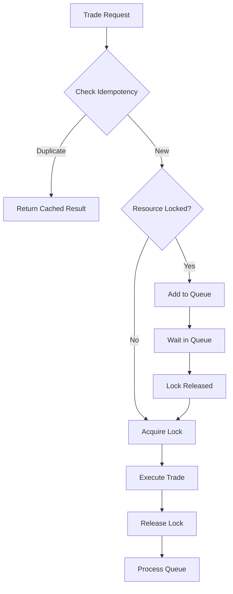

# Transaction Locking System

## Overview

The Transaction Locking System is a critical component designed to prevent duplicate trades and race conditions in the MEXC Sniper Bot. It ensures financial safety by guaranteeing that only one trade can be executed for a specific resource at any given time.

## Key Features

### 1. **Distributed Lock Management**
- Exclusive locks for trade execution
- Resource-based locking (e.g., `trade:BTCUSDT:BUY:snipe123`)
- Automatic lock expiration with configurable timeouts
- Lock ownership tracking for audit trails

### 2. **Idempotency Protection**
- SHA-256 based idempotency keys
- Prevents duplicate requests from executing
- Returns cached results for repeated requests
- Automatic key generation based on transaction data

### 3. **Priority Queue System**
- FIFO processing with priority support
- Sell orders get higher priority than buy orders
- Queue position tracking
- Automatic queue processing on lock release

### 4. **Monitoring & Observability**
- Real-time lock status monitoring
- Transaction queue visualization
- Lock conflict detection
- Performance metrics tracking

## Architecture

### Database Schema

```sql
-- Transaction Locks Table
transaction_locks (
  id                 INTEGER PRIMARY KEY AUTOINCREMENT,
  lockId             TEXT UNIQUE NOT NULL,         -- UUID
  resourceId         TEXT NOT NULL,                -- e.g., "trade:BTCUSDT:BUY"
  idempotencyKey     TEXT UNIQUE NOT NULL,         -- SHA-256 hash
  ownerId            TEXT NOT NULL,                -- User or system ID
  ownerType          TEXT NOT NULL,                -- "user", "system", "workflow"
  acquiredAt         TIMESTAMP DEFAULT NOW(),
  expiresAt          TIMESTAMP NOT NULL,
  releasedAt         TIMESTAMP,
  status             TEXT DEFAULT 'active',         -- "active", "released", "expired", "failed"
  transactionType    TEXT NOT NULL,                -- "trade", "cancel", "update"
  transactionData    TEXT NOT NULL,                -- JSON
  result             TEXT,                          -- JSON result
  errorMessage       TEXT
)

-- Transaction Queue Table
transaction_queue (
  id                 INTEGER PRIMARY KEY AUTOINCREMENT,
  queueId            TEXT UNIQUE NOT NULL,         -- UUID
  lockId             TEXT REFERENCES transaction_locks(lockId),
  resourceId         TEXT NOT NULL,
  priority           INTEGER DEFAULT 5,            -- 1=highest, 10=lowest
  status             TEXT DEFAULT 'pending',       -- "pending", "processing", "completed", "failed"
  transactionData    TEXT NOT NULL,               -- JSON
  idempotencyKey     TEXT NOT NULL,
  queuedAt           TIMESTAMP DEFAULT NOW()
)
```

### Lock Flow



## Usage

### Basic Trade Execution with Lock

```typescript
// In the trade API route
const lockResult = await transactionLockService.executeWithLock(
  {
    resourceId: `trade:${symbol}:${side}:${snipeTargetId}`,
    ownerId: userId,
    ownerType: "user",
    transactionType: "trade",
    transactionData: {
      symbol,
      side,
      type,
      quantity,
      price,
      snipeTargetId,
    },
    timeoutMs: 30000, // 30 second timeout
    priority: side === 'SELL' ? 1 : 5, // Prioritize sells
  },
  async () => {
    // Execute trade logic here
    return await tradingApi.placeOrder(orderParams);
  }
);
```

### Manual Lock Management

```typescript
// Acquire lock
const lockResult = await transactionLockService.acquireLock(config);
if (lockResult.success) {
  try {
    // Execute protected operation
    const result = await executeOperation();
    
    // Release with success
    await transactionLockService.releaseLock(lockResult.lockId, result);
  } catch (error) {
    // Release with error
    await transactionLockService.releaseLock(lockResult.lockId, undefined, error.message);
  }
}
```

### Monitoring Lock Status

```typescript
// Check if resource is locked
const isLocked = await transactionLockService.isResourceLocked("trade:BTCUSDT:BUY");

// Get detailed lock status
const status = await transactionLockService.getLockStatus("trade:BTCUSDT:BUY");
console.log({
  isLocked: status.isLocked,
  activeLocks: status.lockCount,
  queueLength: status.queueLength,
});
```

## API Endpoints

### GET /api/transaction-locks
Retrieve lock and queue information.

Query Parameters:
- `resourceId`: Filter by specific resource
- `ownerId`: Filter by owner
- `status`: Filter by lock status
- `limit`: Maximum results (default: 50)

### DELETE /api/transaction-locks
Release locks manually.

Query Parameters:
- `lockId`: Specific lock to release
- `ownerId`: Release all locks for owner
- `force`: Force release even if active

### POST /api/transaction-locks
Check lock status for a resource.

Body:
```json
{
  "action": "check",
  "resourceId": "trade:BTCUSDT:BUY"
}
```

## Security Considerations

### 1. **Resource ID Design**
- Use consistent patterns: `{type}:{symbol}:{action}:{uniqueId}`
- Include user context when needed
- Avoid exposing sensitive data

### 2. **Timeout Configuration**
- Set appropriate timeouts based on operation type
- Shorter timeouts for simple trades (30s)
- Longer timeouts for complex operations (60s+)
- Always handle timeout scenarios

### 3. **Error Handling**
- Always release locks on error
- Log all lock conflicts
- Monitor for stuck locks
- Implement automatic cleanup

### 4. **Queue Management**
- Limit queue size per resource
- Implement queue timeout
- Priority should reflect business needs
- Monitor queue depth

## Performance Optimization

### 1. **Index Strategy**
All critical columns are indexed:
- `resourceId` for lock lookups
- `idempotencyKey` for duplicate detection
- `status` for active lock queries
- Compound indexes for common queries

### 2. **Cleanup Process**
- Automatic cleanup runs every 5 minutes
- Expired locks marked and removed
- Old completed records purged after 24 hours
- Queue items cleaned after processing

### 3. **Lock Granularity**
- Lock at appropriate resource level
- Avoid overly broad locks
- Consider symbol-specific locking
- Balance between safety and throughput

## Monitoring Dashboard

The Transaction Lock Monitor provides real-time visibility:

1. **Statistics Panel**
   - Active locks count
   - Queue length
   - Recent completions
   - Failed transactions

2. **Active Locks View**
   - Resource details
   - Owner information
   - Time remaining
   - Manual release option

3. **Queue Status**
   - Pending transactions
   - Priority ordering
   - Wait time estimates
   - Position tracking

4. **History Log**
   - Recent completions
   - Failed attempts
   - Performance metrics
   - Error details

## Best Practices

### 1. **Always Use Locks for Financial Operations**
```typescript
// Good
const result = await transactionLockService.executeWithLock(config, tradingLogic);

// Bad - No protection!
const result = await tradingLogic();
```

### 2. **Set Appropriate Priorities**
```typescript
// Sells should have higher priority to secure profits
priority: operation === 'SELL' ? 1 : 5
```

### 3. **Handle Queue Responses**
```typescript
if (lockResult.queuePosition) {
  // Inform user about queue position
  return {
    queued: true,
    position: lockResult.queuePosition,
    message: `Your trade is queued at position ${lockResult.queuePosition}`
  };
}
```

### 4. **Monitor Lock Metrics**
- Track average lock hold time
- Monitor queue depths
- Alert on lock timeouts
- Review failed transactions

## Troubleshooting

### Common Issues

1. **"Transaction already in progress"**
   - Another operation is using the resource
   - Check the lock monitor for details
   - Wait for completion or force release if stuck

2. **"Foreign key constraint failed"**
   - Database cleanup order issue
   - Delete queue items before locks
   - Check for orphaned records

3. **High Queue Depths**
   - Too many concurrent requests
   - Consider increasing timeout
   - Review operation performance
   - Scale horizontally if needed

4. **Expired Locks Not Releasing**
   - Cleanup process may be stopped
   - Manually trigger cleanup
   - Check for database locks
   - Review error logs

## Testing

Run the comprehensive test suite:
```bash
npm test -- __tests__/unit/transaction-lock-service.test.ts
```

Key test scenarios:
- Lock acquisition and release
- Idempotency protection
- Queue processing order
- Concurrent execution prevention
- Error handling
- Cleanup process

## Future Enhancements

1. **Distributed Lock Support**
   - Redis-based locking for multi-instance
   - Redlock algorithm implementation
   - Cross-region synchronization

2. **Advanced Queue Features**
   - Dead letter queue for failures
   - Retry policies
   - Batch processing
   - Queue analytics

3. **Performance Improvements**
   - Lock-free algorithms for read operations
   - Optimistic locking strategies
   - Connection pooling
   - Caching layer

4. **Enhanced Monitoring**
   - Grafana dashboards
   - Prometheus metrics
   - Alert automation
   - Performance profiling