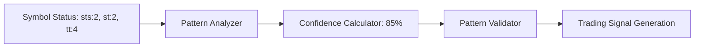

# MEXC Sniper Bot - Detailed Data Flow Analysis

## Executive Summary

This document provides a comprehensive analysis of data flows within the MEXC Sniper Bot system, mapping how information moves between frontend components, backend services, external APIs, and real-time data streams. The analysis covers seven major data flow patterns that form the backbone of the trading automation system.

## 1. System Architecture Overview

### Frontend Layer
- **React Components**: Trading dashboard, configuration panels, monitoring interfaces
- **State Management**: TanStack Query for server state, React hooks for local state  
- **Real-time Updates**: WebSocket connections for live data streaming

### Backend Layer
- **API Routes**: REST endpoints for data operations and configuration
- **Business Logic**: Pattern detection, risk management, trading execution
- **Data Persistence**: PostgreSQL database with Redis caching

### External Integrations
- **MEXC Exchange**: WebSocket streams and REST APIs for market data and trading
- **Third-party Services**: Authentication, monitoring, and notification services

## 2. WebSocket Data Streams Architecture

### Connection Management
The `MexcConnectionManager` class handles all WebSocket connections with advanced features:

```typescript
// Key connection features
- Adaptive reconnection with exponential backoff
- Circuit breaker pattern for failure handling
- Connection health monitoring with quality metrics
- Message queuing during disconnection periods
```

### Stream Processing Pipeline
1. **Raw Data Ingestion**: MEXC WebSocket provides ticker, depth, and status data
2. **Message Parsing**: `StreamProcessor` validates and routes incoming messages
3. **Data Enrichment**: `MarketDataManager` caches and enhances market data
4. **Pattern Analysis**: Real-time pattern detection on symbol status changes
5. **Signal Broadcasting**: Validated patterns distributed to connected clients

### Data Types and Frequencies
- **Ticker Updates**: Price, volume, and change data (~1-5 updates/second per symbol)
- **Depth Updates**: Order book changes (~10-50 updates/second for active pairs)
- **Status Updates**: Symbol listing status changes (event-driven)
- **Trade Data**: Individual trade executions (~variable frequency)

## 3. Pattern Detection Data Flow

### Core Detection Process
The pattern detection system operates on multiple data streams:



### Pattern Types Detected
1. **Ready State Pattern**: `sts:2, st:2, tt:4` indicates imminent trading availability
2. **Price Movement Pattern**: Significant price changes (>5%) trigger analysis
3. **Volume Pattern**: Unusual volume spikes indicate market interest
4. **Combined Patterns**: Multi-factor analysis for higher confidence signals

### Confidence Scoring Algorithm
```typescript
// Confidence calculation factors
- Historical pattern success rate: 40% weight
- Current market conditions: 25% weight  
- Signal timing and frequency: 20% weight
- External market factors: 15% weight
```

## 4. API Request/Response Flow Patterns

### Frontend Data Fetching Strategy
Using TanStack Query for optimized API interactions:

```typescript
// Example query hook pattern
const useOptimizationData = () => {
  return useQuery({
    queryKey: ['tuning', 'optimizations'],
    queryFn: () => fetch('/api/tuning/optimizations').then(res => res.json()),
    refetchInterval: 5000, // Real-time updates
    staleTime: 1000,       // Consider data stale after 1 second
  });
};
```

### Backend API Architecture
1. **Route Handlers**: Next.js API routes with built-in validation
2. **Service Layer**: Business logic abstraction with error handling
3. **Data Access**: Repository pattern with connection pooling
4. **Response Caching**: Strategic caching for frequently accessed data

### Error Handling and Resilience
- **Graceful Degradation**: Fallback to cached data when APIs fail
- **Retry Logic**: Exponential backoff for transient failures
- **Circuit Breakers**: Prevent cascade failures in dependent services
- **User Feedback**: Clear error messages and recovery suggestions

## 5. Real-time Broadcasting System

### WebSocket Server Architecture
The internal WebSocket server manages multiple client connections:

```typescript
// Channel-based message routing
channels: {
  'trading:prices': [...clients],
  'trading:signals': [...clients],
  'notifications:global': [...clients],
  'system:alerts': [...adminClients]
}
```

### Message Types and Routing
1. **Price Updates**: Broadcast to all trading dashboard clients
2. **Pattern Signals**: Routed to auto-sniping and monitoring clients
3. **System Notifications**: Global alerts for all connected users
4. **Admin Alerts**: System health and error messages for administrators

### Performance Optimizations
- **Message Batching**: Group related updates to reduce network overhead
- **Selective Broadcasting**: Only send relevant data to subscribed clients
- **Compression**: Efficient serialization for large datasets
- **Connection Pooling**: Reuse connections for multiple message types

## 6. Auto-Sniping Execution Flow

### Trigger Conditions
Auto-sniping activates when all conditions are met:

```typescript
// Execution criteria
const shouldExecute = (
  patternConfidence > 85 &&
  riskAssessmentPassed &&
  userConfigurationEnabled &&
  availableBalance >= requiredAmount &&
  maxConcurrentPositions < limit
);
```

### Execution Pipeline
1. **Pattern Signal**: High-confidence ready state pattern detected
2. **Risk Validation**: Check position limits, balance, and volatility constraints
3. **Order Preparation**: Calculate position size and exit strategy
4. **Market Execution**: Place buy order through MEXC API
5. **Exit Strategy Setup**: Configure take-profit and stop-loss orders
6. **Monitoring**: Track position performance and market conditions

### Safety Mechanisms
- **Pre-execution Checks**: Validate all conditions before order placement
- **Position Limits**: Enforce maximum concurrent positions and exposure
- **Emergency Stops**: Circuit breakers for unusual market conditions
- **Audit Trail**: Complete logging of all trading decisions and executions

## 7. Configuration Management Flow

### User Preference Persistence
User settings flow through multiple layers:

```typescript
// Configuration data path
Frontend Form → Validation → API Route → Database → Cache → Service Layer
```

### Configuration Types
1. **Trading Parameters**: Buy amounts, stop-loss percentages, risk tolerance
2. **Pattern Settings**: Ready state patterns, confidence thresholds
3. **Notification Preferences**: Alert types, delivery methods, frequency
4. **System Settings**: Connection timeouts, retry attempts, monitoring intervals

### Real-time Configuration Updates
Changes propagate instantly through WebSocket connections:
- User modifies settings in frontend
- Backend validates and persists changes
- Configuration service broadcasts updates
- All relevant services receive new settings
- Active processes adjust behavior immediately

## 8. Performance Monitoring and Metrics

### Data Collection Points
The system collects performance metrics at every layer:

```typescript
// Metric collection areas
- WebSocket connection quality and latency
- API response times and error rates  
- Pattern detection accuracy and timing
- Trading execution speed and success rates
- Database query performance
- Cache hit rates and memory usage
```

### Real-time Dashboards
Performance data flows to monitoring dashboards:
1. **System Health**: Overall system status and component availability
2. **Trading Performance**: Success rates, profitability, and risk metrics
3. **Pattern Accuracy**: Detection rates and false positive analysis
4. **Technical Metrics**: Response times, throughput, and resource usage

## 9. Error Handling and Recovery Flows

### Error Propagation Strategy
Errors are handled at multiple levels with appropriate fallbacks:

```typescript
// Error handling hierarchy
Try: Primary service → Catch: Cached data → Fallback: Mock data → Alert: User notification
```

### Recovery Mechanisms
1. **Automatic Retry**: Transient failures with exponential backoff
2. **Circuit Breakers**: Prevent cascade failures in dependent systems  
3. **Graceful Degradation**: Maintain core functionality during partial outages
4. **Manual Intervention**: Clear escalation paths for critical failures

## 10. Security and Compliance Data Flows

### Data Protection Measures
- **API Authentication**: Secure token-based access control
- **Data Encryption**: In-transit and at-rest encryption for sensitive data
- **Access Logging**: Comprehensive audit trails for all data access
- **Input Validation**: Strict validation at all entry points

### Compliance Considerations
- **Trading Regulations**: Adherence to financial trading requirements
- **Data Privacy**: GDPR-compliant data handling and user consent
- **Rate Limiting**: Respect exchange API limits and terms of service
- **Audit Requirements**: Maintain detailed logs for regulatory review

## Conclusion

The MEXC Sniper Bot implements a sophisticated data flow architecture that efficiently processes real-time market data, detects trading patterns, and executes automated trading decisions. The system's multi-layered approach ensures reliability, performance, and security while providing comprehensive monitoring and configuration capabilities.

Key strengths of the architecture:
- **Resilient Real-time Processing**: Robust handling of market data streams
- **Intelligent Pattern Detection**: Multi-factor analysis with confidence scoring
- **Comprehensive Risk Management**: Multiple safety layers and validation checks
- **Scalable Broadcasting**: Efficient distribution of updates to multiple clients
- **Flexible Configuration**: Real-time settings updates without service interruption

This data flow design enables the bot to operate effectively in the fast-paced cryptocurrency trading environment while maintaining the reliability and safety required for automated financial operations.