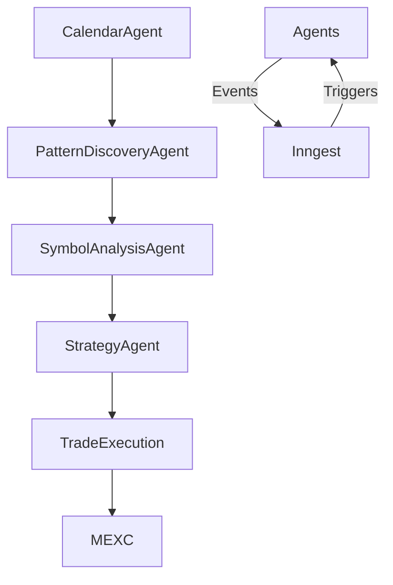

# Quick Agent Setup Guide

This document provides a high level overview of the TypeScript multi‑agent architecture used by the MEXC Sniper Bot and how to get a local environment running.

## Getting Started

1. **Install dependencies** using Bun:
   ```bash
   bun install
   ```
2. **Run database migrations** (SQLite by default, Neon supported):
   ```bash
   bun run db:migrate:safe
   ```
3. **Start development servers** which launch Next.js and Inngest:
   ```bash
   make dev
   # http://localhost:3008
   ```

## Required Environment

- `OPENAI_API_KEY`
- `KINDE_ISSUER_URL` and credentials
- Optional: `MEXC_API_KEY` / `MEXC_SECRET_KEY` and `DATABASE_URL` for Neon.

Create a `.env.local` file and populate these variables before running the bot.

## Architecture Overview

The system follows a hexagonal design where domain logic lives in `src/domain` and infrastructure (database, exchange adapters, web UI) sits at the edges. Workflows are coordinated through Inngest events. A simplified flow is:



OpenTelemetry is configured for tracing and Prometheus metrics. All code files remain under 500 lines to maintain modularity.

## Common Commands

```bash
make lint           # Format and lint the code
make type-check     # Run TypeScript checks
make test           # Run Vitest + Playwright tests
make pre-commit     # lint + type-check (used before commits)
```

See [../README.md](../README.md) for more documentation links.
