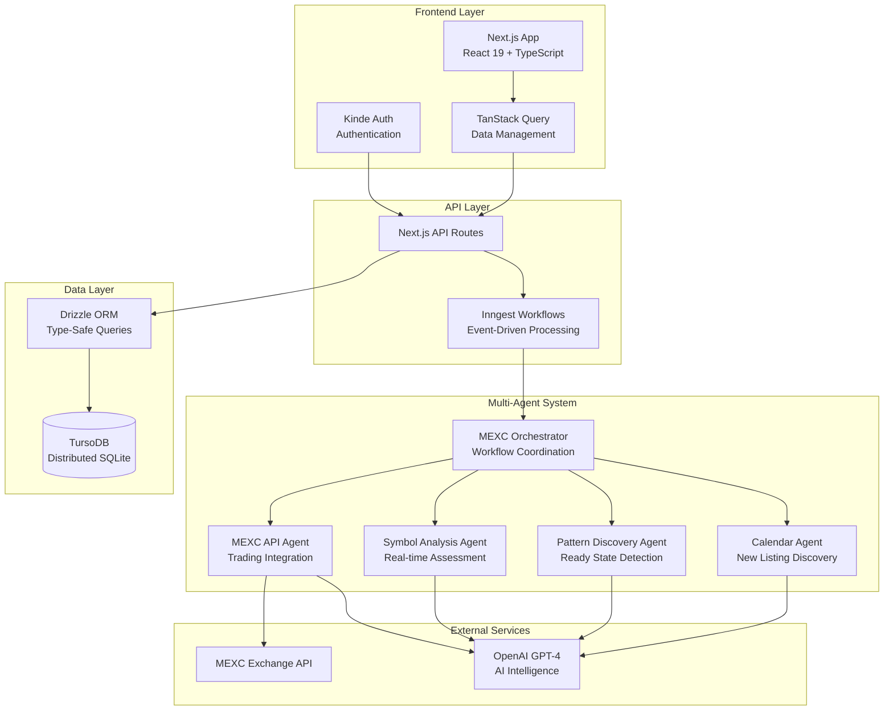
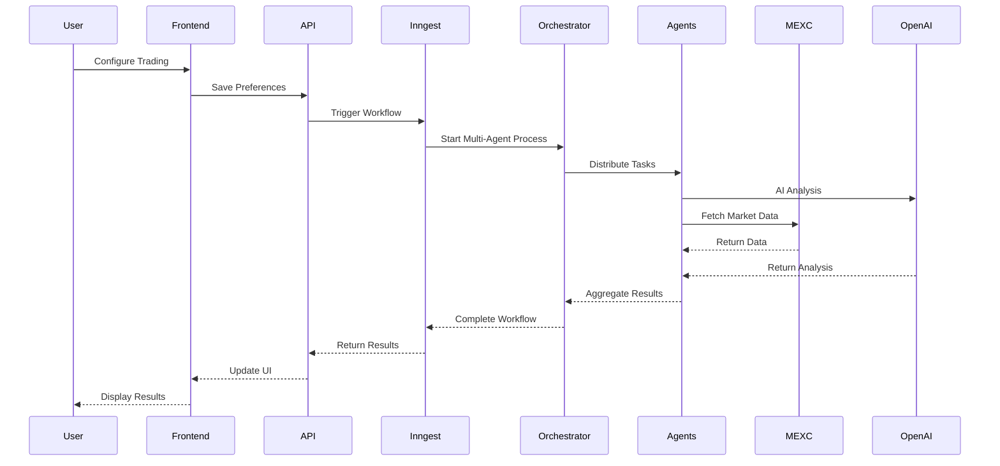
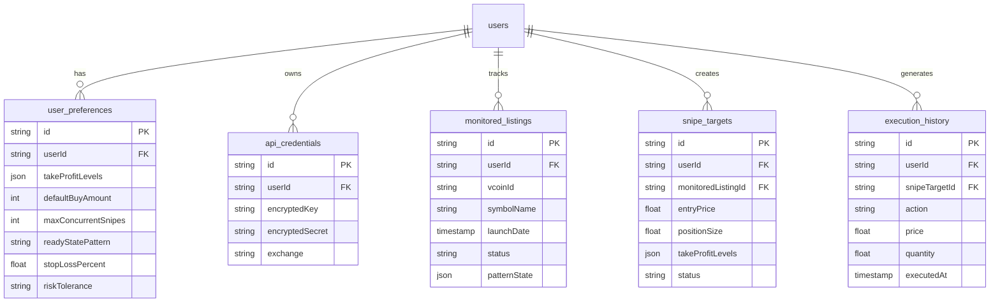
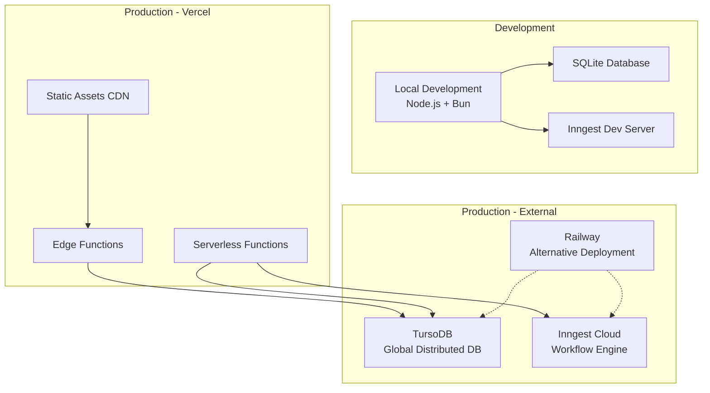
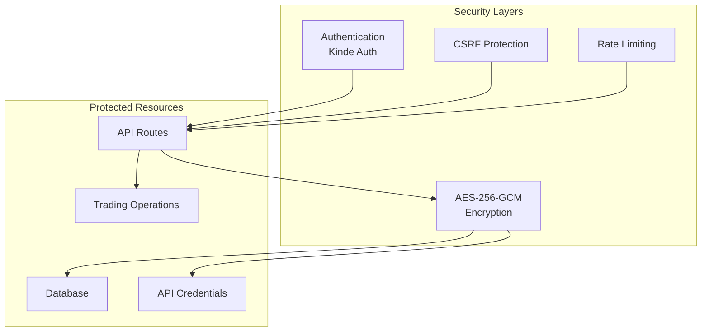
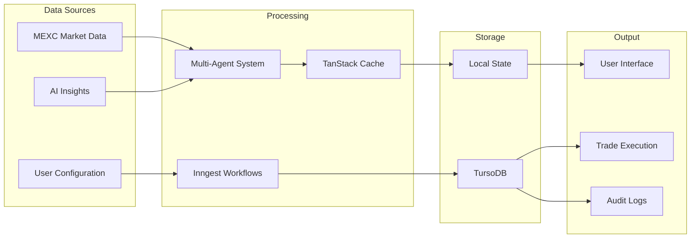
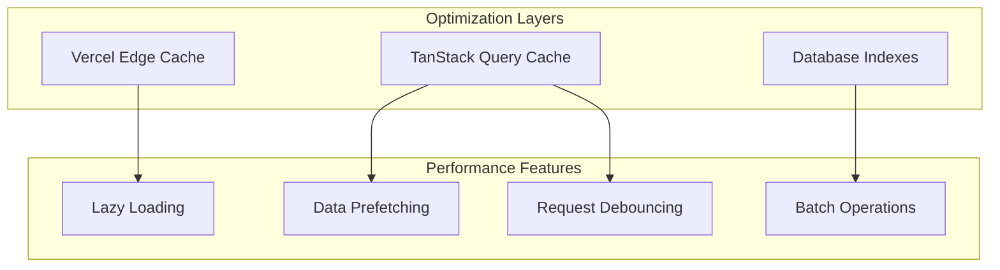
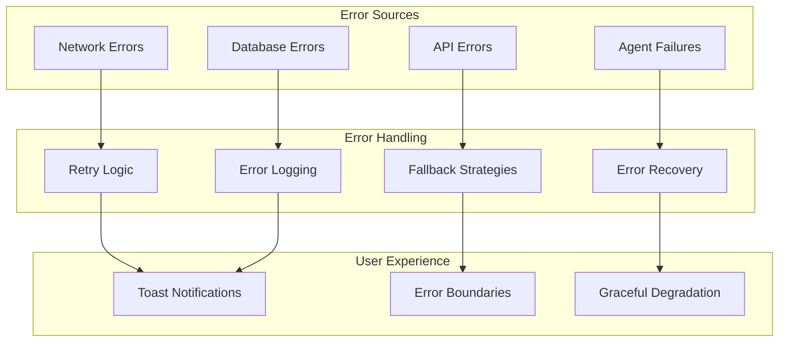
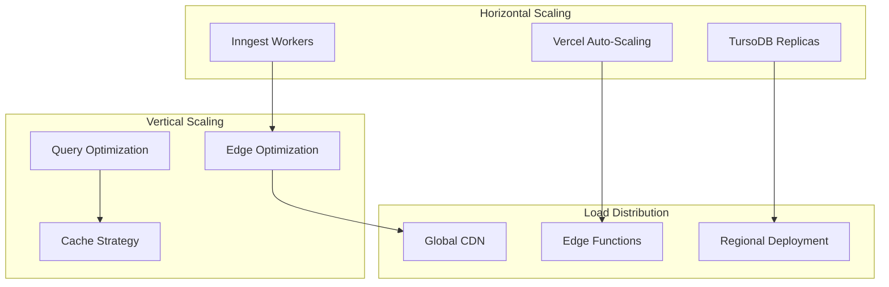

# MEXC Sniper Bot Architecture Diagram 🏗️

## System Overview



## Component Architecture

```mermaid
flowchart LR
    subgraph "User Interface"
        Dashboard[Trading Dashboard]
        Config[User Configuration]
        Monitor[Safety Monitoring]
    end

    subgraph "State Management"
        TanStack[TanStack Query]
        Hooks[Custom React Hooks]
    end

    subgraph "API Routes"
        Auth[/api/auth/*]
        Triggers[/api/triggers/*]
        Schedule[/api/schedule/*]
        MEXC[/api/mexc/*]
    end

    Dashboard --> TanStack
    Config --> Hooks
    Monitor --> TanStack

    TanStack --> Auth
    TanStack --> Triggers
    Hooks --> Schedule
    Hooks --> MEXC
```

## Agent Communication Flow



## Database Schema Overview



## Deployment Architecture



## Security Architecture



## Data Flow Architecture



## Performance Architecture



## Error Handling Architecture



## Scalability Architecture

