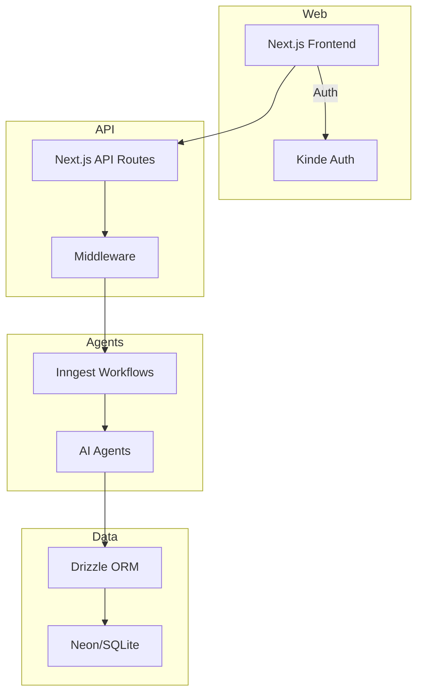

# Codebase Architecture Review

This document provides a high level overview of the current architecture, key integration points, and a prioritized refactoring plan for the MEXC Sniper Bot. All references use existing code and directories from this repository.

## System Overview



**Key Integration Points**
- **Authentication**: `Kinde` integrates with Next.js routes via middleware in `middleware.ts`.
- **Workflows**: Inngest functions reside in `src/inngest` and trigger agent logic under `src/mexc-agents`.
- **Database**: Drizzle models are defined in `src/db` and migrations under `src/db/migrations`.
- **Monitoring**: OpenTelemetry setup in `monitoring/` with metrics exporters.

## Code Quality Findings

### Large Files
Several files exceed the 500 line guideline, impacting readability and maintainability. Examples:
- `src/core/pattern-detection/pattern-analyzer.ts` (668 lines)【F:src/core/pattern-detection/pattern-analyzer.ts†L1-L38】
- `src/services/trading/consolidated/core-trading/auto-sniping.ts` (over 2000 lines)【F:src/services/trading/consolidated/core-trading/auto-sniping.ts†L1-L33】
- `src/db/migrations/schema.ts` (1848 lines)【F:src/db/migrations/schema.ts†L1-L20】

### Error Handling
Error logging patterns vary. Example from the pattern analyzer:
```ts
try {
  // ...
} catch (error) {
  const safeError = toSafeError(error);
  this.context.logger.error("Failed to close position manually", {
    positionId,
    reason,
    error: safeError,
  });
}
```
Consistency across modules is lacking.

### Complexity and Duplication
- Multiple trading services under `src/services/trading` with overlapping responsibilities.
- Redundant API client implementations (`mexc-api-client.ts`, `mexc-client-core.ts`).
- Several websocket servers and risk coordinators provide similar functions.

### Dead Code Indicators
- Unused variable patterns and commented-out sections exist in legacy services.
- Files under `src/services/__legacy` and `src/services/__old` are not referenced by modern modules.

## Recommended Architecture Improvements

1. **Service Consolidation**
   - Merge duplicate trading and risk services into single cohesive modules (see `src/services/__architecture-analysis/CONSOLIDATION_PLAN.md`).
   - Introduce clear interfaces in `src/application/interfaces` for trading, data, and risk domains.

2. **Domain-Driven Structure**
   - Restructure `src` to group files by bounded context: `domain`, `application`, `infrastructure`, `interfaces`, and `ui`.
   - Move large workflow definitions into separate modules under `src/workflows` with small (<500 line) files.

3. **Design Patterns**
   - Factory pattern for MEXC API clients.
   - Observer pattern for real-time event subscriptions.
   - Strategy pattern for trading algorithms to swap implementations easily.

4. **Type Safety & Validation**
   - Use `Zod` schemas in API route handlers for input validation.
   - Enforce strict TypeScript config across all packages.

## Performance Optimization Opportunities

- **Database**: Review query indexes in `src/db/migrations/schema.ts`; heavy queries in `auto-sniping.ts` may benefit from optimized joins.
- **React Rendering**: Components like `OptimizedAgentsDashboard` may re-render too often—memoize hooks and use `React.memo`.
- **Resource Management**: Websocket servers under `src/services/data` may leak listeners; ensure `removeListener` is called on shutdown.

## Dependency Audit

Run `npm prune` and check `package.json` for unused libraries. Consider lighter alternatives to heavy packages like `lodash` (replace with native utilities) and ensure tree-shaking friendly imports (`import { x } from 'lodash-es'`).

## Dead Code Removal Checklist

- Delete unused folders like `src/services/__legacy` once confirmed.
- Remove commented blocks that refer to old logging frameworks.
- Search for `// TEMP` and `// DEBUG` markers and clean them up.

## Implementation Guide (Vertical Slices)

Each slice should follow TDD: create tests first, run them to fail, implement, then pass. Use feature branches and conventional commits.

### Slice 1: Establish Baseline Testing
- **Goal**: Ensure tests run in CI with existing code.
- **Steps**:
  1. `git checkout -b chore/setup-testing`
  2. Add minimal Vitest config if missing.
  3. Run `make test` until green.
  4. Commit with `chore: ensure baseline tests pass`.
- **Definition of Done**: CI passes with no failing tests.
- **Complexity**: 2/10

### Slice 2: Extract Trading Strategy Interface
- **Goal**: Introduce an interface for trading strategies and refactor one implementation.
- **Steps**:
  1. `git checkout -b refactor/trading-strategy-interface`
  2. Create `src/domain/trading/strategy.ts` defining the `TradingStrategy` interface.
  3. Write unit tests for one concrete strategy.
  4. Refactor `auto-sniping.ts` to use the interface.
  5. Run `make lint && make type-check && make test`.
  6. Commit with `refactor: abstract trading strategy interface`.
- **Definition of Done**: `auto-sniping.ts` under 500 lines for the refactored section, all tests pass.
- **Complexity**: 6/10

### Slice 3: Unified MEXC API Client
- **Goal**: Consolidate multiple client files into a factory pattern.
- **Steps**:
  1. `git checkout -b refactor/mexc-client-factory`
  2. Move code from `mexc-api-client.ts` and `mexc-client-core.ts` into `src/infrastructure/mexc/client.ts` with a factory.
  3. Add Zod schema for config validation.
  4. Update imports across services.
  5. Add tests for request retry logic.
  6. Commit with `refactor: unify mexc api client`.
- **Definition of Done**: Single client module with tests and docs updated.
- **Complexity**: 7/10

### Slice 4: Clean Up Legacy Services
- **Goal**: Remove unused `__legacy` directory and old code paths.
- **Steps**:
  1. `git checkout -b chore/remove-legacy`
  2. Delete `src/services/__legacy` and references.
  3. Run full test suite.
  4. Commit with `chore: remove legacy services`.
- **Definition of Done**: Folder removed, tests pass.
- **Complexity**: 3/10

### Slice 5: Introduce Monitoring Middleware
- **Goal**: Centralize metrics collection using OpenTelemetry.
- **Steps**:
  1. `git checkout -b feat/monitoring-middleware`
  2. Create `src/middleware/monitoring.ts` to time API requests.
  3. Add unit tests with mocked timers.
  4. Integrate into `next.config.ts` or API routes.
  5. Commit with `feat: add monitoring middleware`.
- **Definition of Done**: Metrics recorded for each API call.
- **Complexity**: 5/10

## Further Reading
- [NeonDB Best Practices](docs/deployment/neon-best-practices.md)
- [Inngest Documentation](https://www.inngest.com/docs)
- [Zod Validation](https://zod.dev/)

For deeper research, junior developers can explore each topic in the docs directory or external links above.

