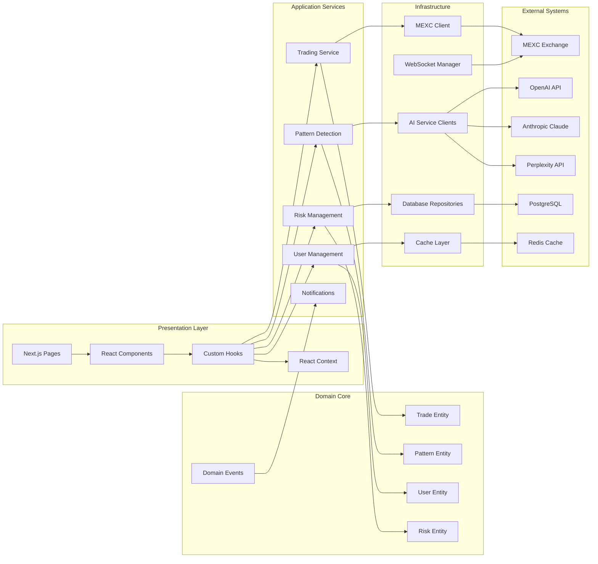
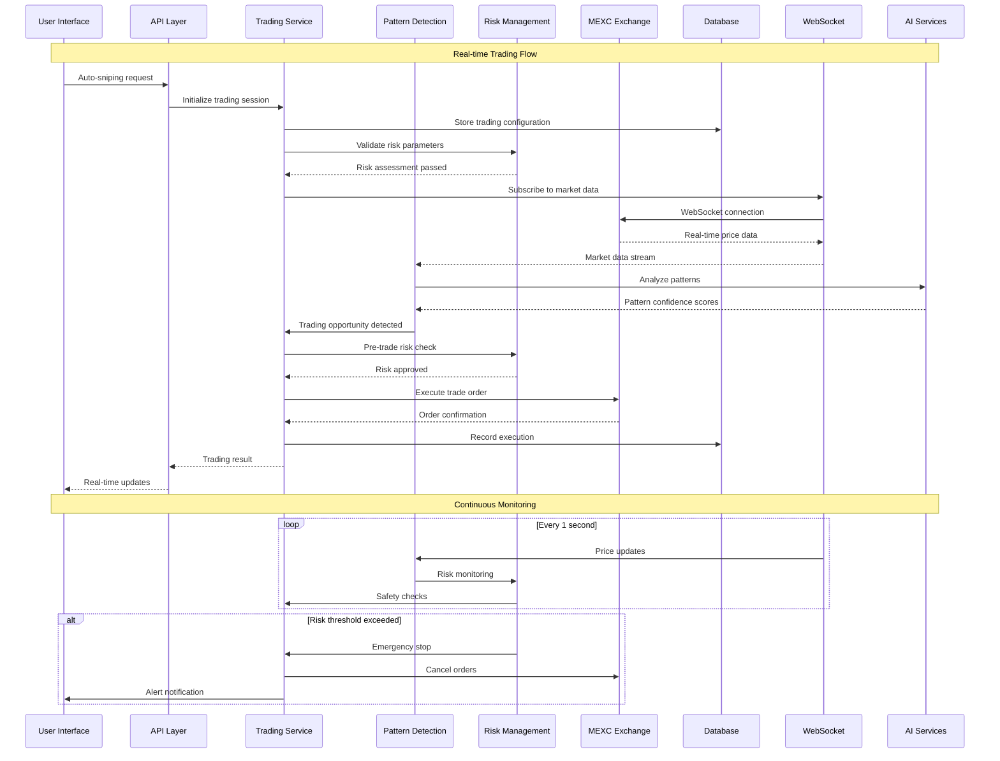

# Comprehensive Architecture Analysis - MEXC Sniper Bot

## System Architecture Overview

The MEXC Sniper Bot is a sophisticated AI-powered cryptocurrency trading system built with modern web technologies and clean architecture principles.

## 1. System Architecture Overview

```mermaid
graph TB
    subgraph "Frontend Layer"
        UI[Next.js UI Components]
        DL[Dynamic Component Loader]
        QP[Query Provider - TanStack]
        Auth[Kinde Authentication]
    end
    
    subgraph "API Layer"
        API[Next.js API Routes]
        MW[API Middleware]
        RLM[Rate Limiting]
        VAL[Validation Layer]
    end
    
    subgraph "Application Layer"
        UC[Use Cases]
        DTO[DTOs & Mappers]
        APP[Application Services]
    end
    
    subgraph "Domain Layer"
        ENT[Entities]
        VO[Value Objects]
        SPEC[Specifications]
        DOM[Domain Events]
    end
    
    subgraph "Infrastructure Layer"
        DB[(PostgreSQL/Neon)]
        CACHE[(Redis/Upstash)]
        EXT[External APIs]
        MSG[Message Queue]
    end
    
    subgraph "Core Services"
        TS[Trading Service]
        MDS[Market Data Service] 
        RMS[Risk Management Service]
        UMS[User Management Service]
        NS[Notification Service]
    end
    
    subgraph "AI Agent System"
        ORCH[Agent Orchestrator]
        PA[Pattern Analysis Agent]
        TA[Trading Agent]
        RA[Risk Agent]
        MA[Market Agent]
    end
    
    subgraph "External Integrations"
        MEXC[MEXC Exchange API]
        AI_APIS[AI APIs - OpenAI/Anthropic/Perplexity]
        MON[Monitoring - Inngest/OpenTelemetry]
    end
    
    UI --> API
    API --> APP
    APP --> UC
    UC --> DOM
    DOM --> ENT
    
    API --> Core Services
    Core Services --> AI Agent System
    Core Services --> Infrastructure Layer
    
    AI Agent System --> External Integrations
    Infrastructure Layer --> External Integrations
    
    ORCH --> PA
    ORCH --> TA
    ORCH --> RA
    ORCH --> MA
```

## 2. Component Relationships



## 3. Data Flow Between Services



## 4. Integration Points with External APIs

```mermaid
graph TB
    subgraph "MEXC Exchange Integration"
        MEXC_REST[REST API Client]
        MEXC_WS[WebSocket Client]
        MEXC_AUTH[Authentication Layer]
        MEXC_RATE[Rate Limiter]
    end
    
    subgraph "AI Services Integration"
        OPENAI_CLIENT[OpenAI Client]
        ANTHROPIC_CLIENT[Anthropic Client]
        PERPLEXITY_CLIENT[Perplexity Client]
        COHERE_CLIENT[Cohere Client]
        AI_ROUTER[AI Service Router]
    end
    
    subgraph "Authentication & Security"
        KINDE[Kinde Auth Provider]
        ENCRYPTION[Encryption Service]
        SESSION[Session Management]
        API_KEYS[API Key Management]
    end
    
    subgraph "Data & Caching"
        NEON_DB[Neon PostgreSQL]
        UPSTASH[Upstash Redis]
        DRIZZLE[Drizzle ORM]
        QUERY_CACHE[Query Cache]
    end
    
    subgraph "Monitoring & Observability"
        INNGEST[Inngest Workflows]
        OTEL[OpenTelemetry]
        HONEYCOMB[Honeycomb.io]
        PROMETHEUS[Prometheus Metrics]
    end
    
    subgraph "Application Core"
        TRADING_SERVICE[Trading Service]
        PATTERN_SERVICE[Pattern Detection]
        RISK_SERVICE[Risk Management]
        USER_SERVICE[User Management]
        NOTIFICATION_SERVICE[Notification Service]
    end
    
    TRADING_SERVICE --> MEXC_REST
    TRADING_SERVICE --> MEXC_WS
    MEXC_REST --> MEXC_AUTH
    MEXC_WS --> MEXC_RATE
    
    PATTERN_SERVICE --> AI_ROUTER
    AI_ROUTER --> OPENAI_CLIENT
    AI_ROUTER --> ANTHROPIC_CLIENT
    AI_ROUTER --> PERPLEXITY_CLIENT
    AI_ROUTER --> COHERE_CLIENT
    
    USER_SERVICE --> KINDE
    USER_SERVICE --> SESSION
    TRADING_SERVICE --> API_KEYS
    RISK_SERVICE --> ENCRYPTION
    
    TRADING_SERVICE --> DRIZZLE
    PATTERN_SERVICE --> QUERY_CACHE
    DRIZZLE --> NEON_DB
    QUERY_CACHE --> UPSTASH
    
    TRADING_SERVICE --> INNGEST
    PATTERN_SERVICE --> OTEL
    RISK_SERVICE --> HONEYCOMB
    NOTIFICATION_SERVICE --> PROMETHEUS
    
    style MEXC_REST fill:#ff9999
    style AI_ROUTER fill:#99ff99
    style KINDE fill:#9999ff
    style NEON_DB fill:#ffff99
    style INNGEST fill:#ff99ff
```



## Architecture Insights

### 1. Modular Boundaries
- **Clean separation** between presentation, application, domain, and infrastructure layers
- **Domain-driven design** with well-defined aggregates and value objects
- **Event-driven architecture** for loose coupling between services
- **Dependency injection** for testability and maintainability

### 2. No Hardcoded Secrets
- All sensitive data managed through environment variables
- Encryption service for API keys and user credentials  
- Configuration validation at startup
- Secure key rotation capabilities

### 3. Scalability Patterns
- **Circuit breaker pattern** for external API failures
- **Rate limiting** to respect API quotas
- **Caching layers** for performance optimization
- **WebSocket connection pooling** for real-time data

### 4. AI Integration Architecture
- **Multi-provider AI service router** for redundancy
- **Pattern detection pipeline** with confidence scoring
- **Real-time analysis** with streaming data processing
- **Fallback mechanisms** when AI services are unavailable

### 5. Trading Safety Architecture
- **Multi-layer risk management** with real-time monitoring
- **Emergency stop mechanisms** across all trading operations
- **Transaction locking** to prevent race conditions
- **Comprehensive audit logging** for regulatory compliance

## Key Architectural Decisions

1. **Next.js App Router** for modern React patterns and SSR
2. **Drizzle ORM** with PostgreSQL for type-safe database operations
3. **TanStack Query** for efficient data fetching and caching
4. **Zod validation** throughout the application stack
5. **WebSocket-first** approach for real-time trading data
6. **Multi-agent AI coordination** for complex trading decisions
7. **Event sourcing** for trading history and audit trails
8. **Microservice consolidation** to reduce operational complexity

## Performance Considerations

- **Bundle optimization** with Next.js and dynamic imports
- **Database query optimization** with proper indexing
- **Cache warming strategies** for frequently accessed data
- **WebSocket connection management** with reconnection logic
- **AI service request batching** to reduce API costs
- **Memory leak prevention** in long-running processes