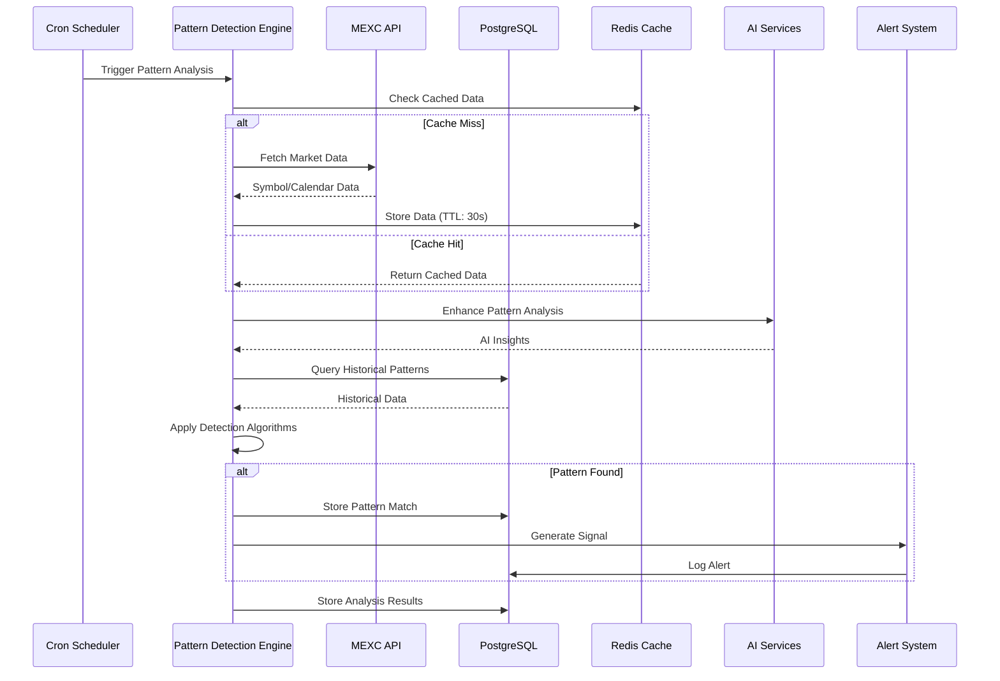
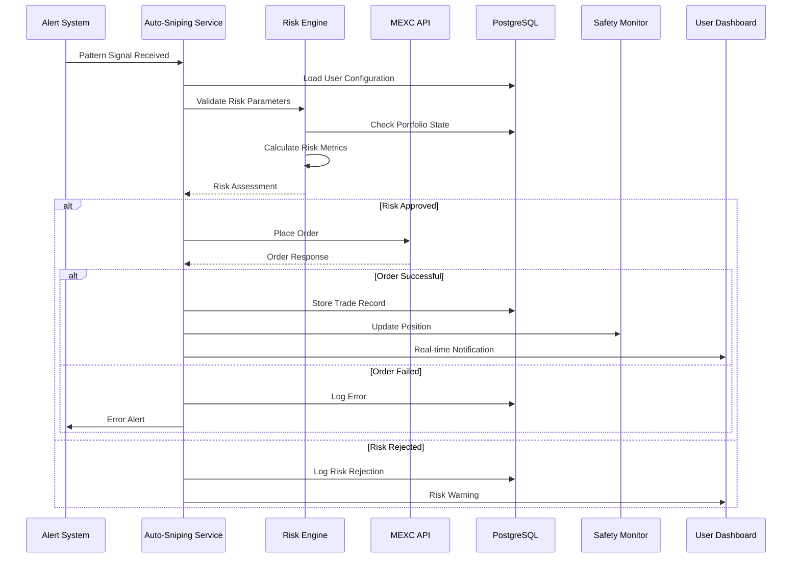
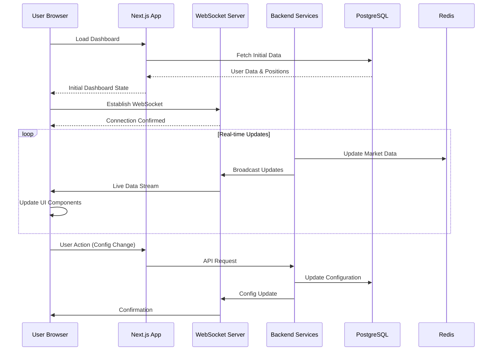
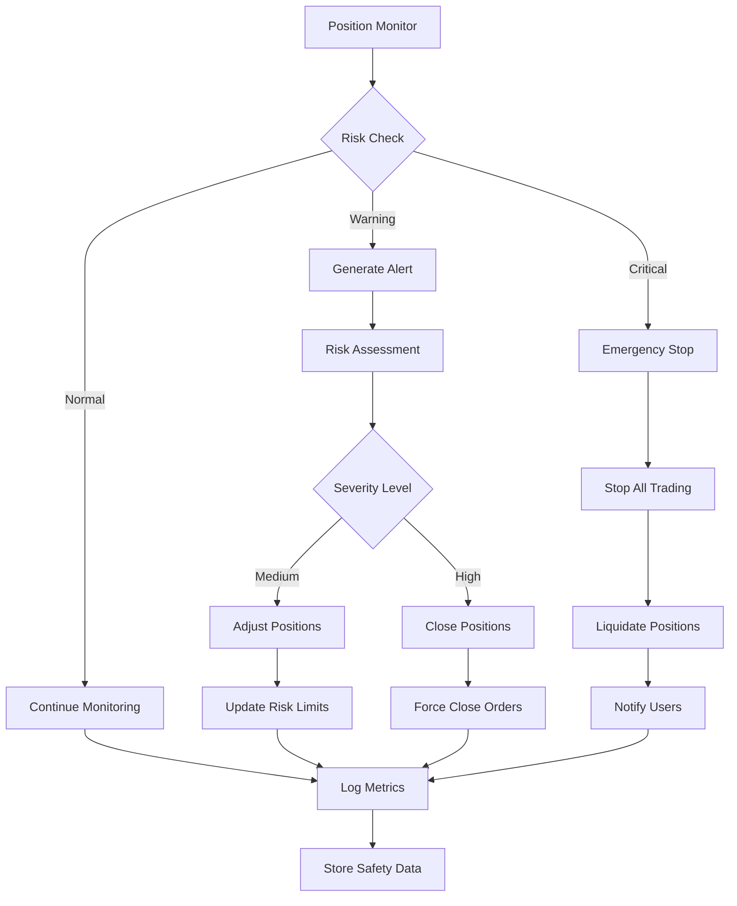
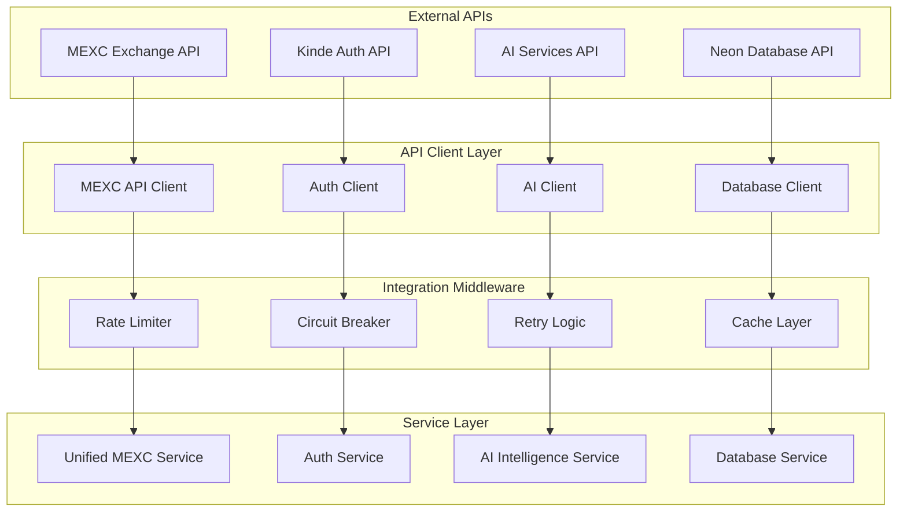

# MEXC Trading Bot - Data Flows & Integration Architecture

## Data Flow Overview

The MEXC Trading Bot processes data through multiple interconnected flows, each optimized for specific use cases: real-time trading, pattern analysis, risk management, and user interactions.

## Primary Data Flows

### 1. **Pattern Detection & Signal Generation Flow**



### 2. **Auto-Sniping Execution Flow**



### 3. **Real-time Dashboard Data Flow**



### 4. **Risk Management & Safety Flow**



## Data Integration Architecture

### 1. **External API Integration**



### 2. **Database Integration Patterns**

```typescript
// Repository Pattern for Data Access
interface IPatternRepository {
  findBySymbol(symbol: string): Promise<PatternMatch[]>;
  createPatternMatch(pattern: PatternMatch): Promise<void>;
  updateConfidence(id: string, confidence: number): Promise<void>;
}

interface ITradingRepository {
  createOrder(order: OrderRecord): Promise<string>;
  updateOrderStatus(id: string, status: OrderStatus): Promise<void>;
  getActivePositions(userId: string): Promise<Position[]>;
}

// Unit of Work Pattern for Transactions
class TradingUnitOfWork {
  constructor(
    private db: Database,
    private patternRepo: IPatternRepository,
    private tradingRepo: ITradingRepository
  ) {}
  
  async executeTradeWithPattern(
    pattern: PatternMatch,
    order: OrderParameters
  ): Promise<void> {
    await this.db.transaction(async (tx) => {
      // Update pattern as processed
      await this.patternRepo.updateConfidence(pattern.id, pattern.confidence);
      
      // Create trade record
      const orderId = await this.tradingRepo.createOrder({
        ...order,
        patternId: pattern.id,
        timestamp: new Date()
      });
      
      // Log the connection between pattern and trade
      await this.logPatternTrade(pattern.id, orderId);
    });
  }
}
```

### 3. **Caching Strategy**

```typescript
// Multi-level Caching Architecture
interface CacheStrategy {
  level1: InMemoryCache;    // 1-5 seconds (hot data)
  level2: RedisCache;       // 30 seconds - 5 minutes (warm data)  
  level3: DatabaseCache;    // 5+ minutes (cold data)
}

class EnhancedCacheManager {
  async get<T>(key: string): Promise<T | null> {
    // Try Level 1 (Memory)
    let data = await this.level1.get<T>(key);
    if (data) return data;
    
    // Try Level 2 (Redis)
    data = await this.level2.get<T>(key);
    if (data) {
      await this.level1.set(key, data, 5000); // 5 second TTL
      return data;
    }
    
    // Try Level 3 (Database)
    data = await this.level3.get<T>(key);
    if (data) {
      await this.level2.set(key, data, 60000); // 1 minute TTL
      await this.level1.set(key, data, 5000);  // 5 second TTL
      return data;
    }
    
    return null;
  }
  
  async set<T>(key: string, value: T, ttl: number): Promise<void> {
    // Set in all levels with appropriate TTLs
    await Promise.all([
      this.level1.set(key, value, Math.min(ttl, 5000)),
      this.level2.set(key, value, Math.min(ttl, 300000)),
      this.level3.set(key, value, ttl)
    ]);
  }
}
```

### 4. **Event-Driven Data Flow**

```typescript
// Event System for Loose Coupling
interface DomainEvent {
  type: string;
  aggregateId: string;
  version: number;
  timestamp: Date;
  payload: any;
}

interface EventHandler<T extends DomainEvent> {
  handle(event: T): Promise<void>;
}

class EventBus {
  private handlers = new Map<string, EventHandler<any>[]>();
  
  subscribe<T extends DomainEvent>(
    eventType: string, 
    handler: EventHandler<T>
  ): void {
    const existing = this.handlers.get(eventType) || [];
    this.handlers.set(eventType, [...existing, handler]);
  }
  
  async publish<T extends DomainEvent>(event: T): Promise<void> {
    const handlers = this.handlers.get(event.type) || [];
    await Promise.all(handlers.map(handler => handler.handle(event)));
  }
}

// Example Event Handlers
class PatternDetectedHandler implements EventHandler<PatternDetectedEvent> {
  async handle(event: PatternDetectedEvent): Promise<void> {
    // Trigger auto-sniping evaluation
    await this.autoSnipingService.evaluatePattern(event.payload);
  }
}

class OrderExecutedHandler implements EventHandler<OrderExecutedEvent> {
  async handle(event: OrderExecutedEvent): Promise<void> {
    // Update portfolio tracking
    await this.portfolioService.updatePosition(event.payload);
    
    // Send user notification
    await this.notificationService.sendOrderConfirmation(event.payload);
  }
}
```

## Data Consistency & Integrity

### 1. **ACID Transactions**

```typescript
// Critical trading operations use database transactions
class TradingTransactionManager {
  async executeAtomicTrade(
    userId: string,
    orderParams: OrderParameters,
    riskAssessment: RiskAssessment
  ): Promise<TradeResult> {
    return await this.db.transaction(async (tx) => {
      // 1. Lock user account to prevent concurrent trades
      await tx.execute(sql`
        SELECT * FROM users WHERE id = ${userId} FOR UPDATE
      `);
      
      // 2. Verify risk limits are still valid
      const currentRisk = await this.calculateCurrentRisk(tx, userId);
      if (currentRisk.exceedsLimits()) {
        throw new RiskLimitExceededException();
      }
      
      // 3. Reserve funds for the trade
      await this.reserveFunds(tx, userId, orderParams.totalCost);
      
      // 4. Place order with external exchange
      const orderResult = await this.mexcService.placeOrder(orderParams);
      
      // 5. Store trade record
      await this.storeTrade(tx, {
        userId,
        orderId: orderResult.orderId,
        params: orderParams,
        riskAssessment,
        timestamp: new Date()
      });
      
      return orderResult;
    });
  }
}
```

### 2. **Data Validation Pipeline**

```typescript
// Input validation at multiple layers
class DataValidationPipeline {
  async validateTradingData(data: any): Promise<ValidationResult> {
    const validators = [
      new SchemaValidator(),
      new BusinessRuleValidator(),
      new SecurityValidator(),
      new RiskValidator()
    ];
    
    for (const validator of validators) {
      const result = await validator.validate(data);
      if (!result.isValid) {
        return result;
      }
    }
    
    return { isValid: true };
  }
}

class SchemaValidator implements IValidator {
  async validate(data: any): Promise<ValidationResult> {
    // Zod schema validation
    const result = TradingDataSchema.safeParse(data);
    return {
      isValid: result.success,
      errors: result.error?.issues || []
    };
  }
}

class BusinessRuleValidator implements IValidator {
  async validate(data: TradingData): Promise<ValidationResult> {
    const errors: string[] = [];
    
    // Validate business rules
    if (data.quantity <= 0) {
      errors.push('Quantity must be positive');
    }
    
    if (data.symbol && !this.isValidSymbol(data.symbol)) {
      errors.push('Invalid trading symbol');
    }
    
    return {
      isValid: errors.length === 0,
      errors
    };
  }
}
```

### 3. **Data Synchronization**

```typescript
// Eventual consistency for non-critical data
class DataSynchronizationService {
  async syncPatternData(): Promise<void> {
    // Sync pattern embeddings with vector database
    const pendingPatterns = await this.getPendingPatterns();
    
    for (const pattern of pendingPatterns) {
      try {
        await this.vectorDB.upsertEmbedding(pattern.id, pattern.embedding);
        await this.markAsSynced(pattern.id);
      } catch (error) {
        await this.markAsFailed(pattern.id, error.message);
      }
    }
  }
  
  async reconcilePortfolioData(): Promise<void> {
    // Reconcile local portfolio data with exchange data
    const localPositions = await this.getLocalPositions();
    const exchangePositions = await this.mexcService.getPositions();
    
    const discrepancies = this.findDiscrepancies(localPositions, exchangePositions);
    
    if (discrepancies.length > 0) {
      await this.reportDiscrepancies(discrepancies);
      await this.resyncPositions(exchangePositions);
    }
  }
}
```

## Performance Optimization

### 1. **Database Query Optimization**

```sql
-- Optimized queries with proper indexing
CREATE INDEX CONCURRENTLY idx_pattern_matches_symbol_timestamp 
ON pattern_matches(symbol, detected_at DESC) 
WHERE confidence > 0.7;

CREATE INDEX CONCURRENTLY idx_trades_user_status_timestamp
ON trades(user_id, status, created_at DESC);

-- Materialized view for expensive aggregations
CREATE MATERIALIZED VIEW portfolio_performance AS
SELECT 
  user_id,
  DATE_TRUNC('day', created_at) as trade_date,
  SUM(CASE WHEN side = 'BUY' THEN quantity * price ELSE 0 END) as total_buys,
  SUM(CASE WHEN side = 'SELL' THEN quantity * price ELSE 0 END) as total_sells,
  COUNT(*) as trade_count
FROM trades 
WHERE status = 'FILLED'
GROUP BY user_id, DATE_TRUNC('day', created_at);

-- Refresh materialized view periodically
REFRESH MATERIALIZED VIEW CONCURRENTLY portfolio_performance;
```

### 2. **Connection Pooling**

```typescript
// Optimized database connection management
class DatabaseConnectionPool {
  private pool: Pool;
  
  constructor() {
    this.pool = new Pool({
      host: config.database.host,
      port: config.database.port,
      database: config.database.name,
      user: config.database.user,
      password: config.database.password,
      
      // Connection pool settings
      min: 2,                 // Minimum connections
      max: 20,                // Maximum connections
      idleTimeoutMillis: 30000, // Close idle connections after 30s
      connectionTimeoutMillis: 5000, // Connection timeout
      
      // Query timeout
      query_timeout: 10000,
      
      // SSL settings for production
      ssl: process.env.NODE_ENV === 'production' ? {
        rejectUnauthorized: false
      } : false
    });
  }
  
  async query<T>(text: string, params?: any[]): Promise<QueryResult<T>> {
    const client = await this.pool.connect();
    try {
      const start = Date.now();
      const result = await client.query(text, params);
      const duration = Date.now() - start;
      
      // Log slow queries
      if (duration > 1000) {
        logger.warn('Slow query detected', { text, duration, params });
      }
      
      return result;
    } finally {
      client.release();
    }
  }
}
```

This comprehensive data flow architecture ensures efficient, secure, and reliable data processing throughout the MEXC Trading Bot system while maintaining performance and consistency across all operations.