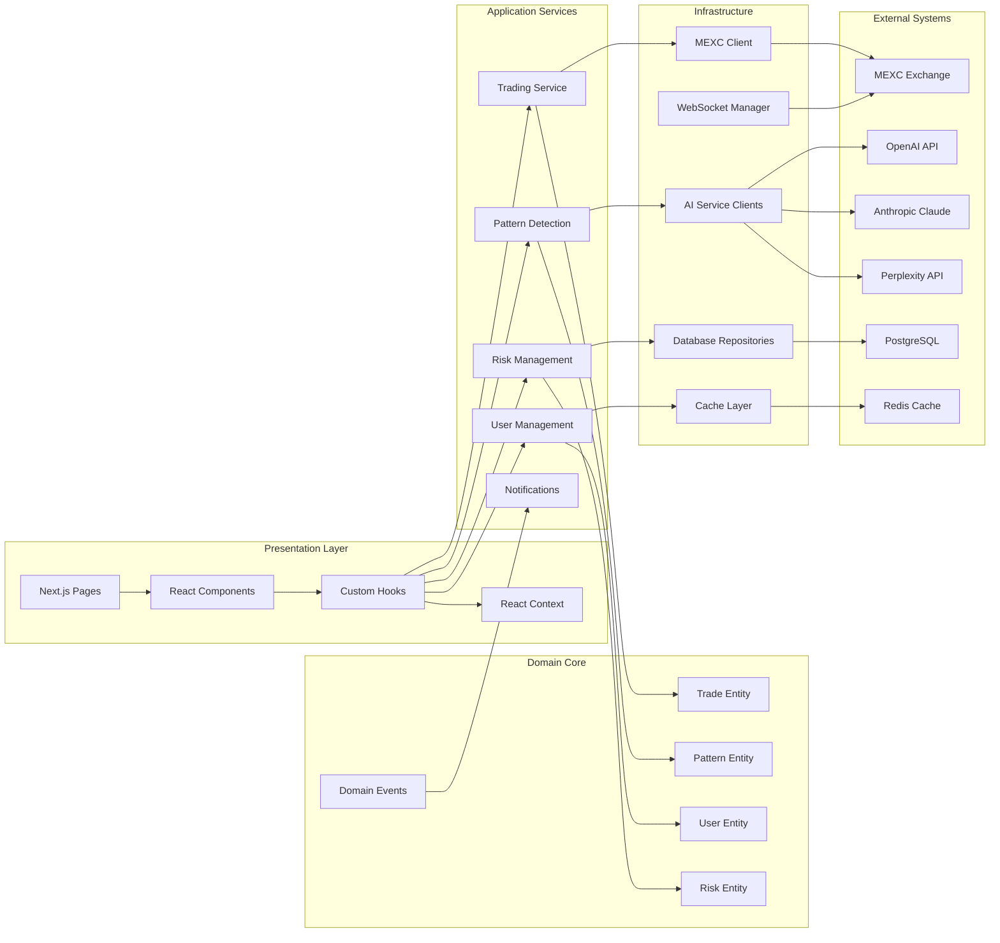
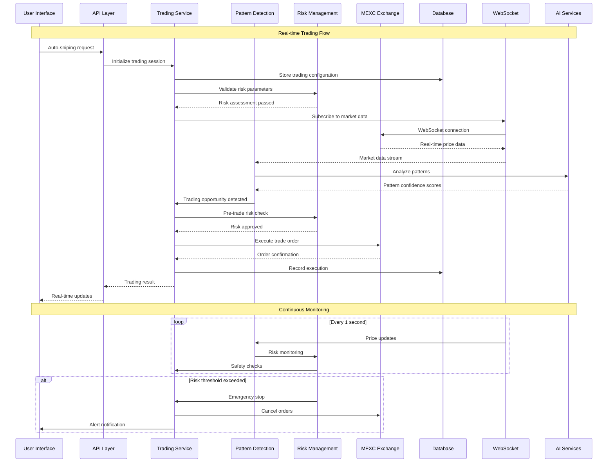
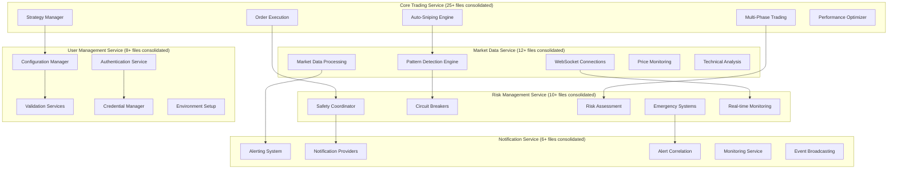

# Comprehensive Mermaid Diagrams - MEXC Sniper Bot Architecture

## 1. System Architecture Overview

```mermaid
graph TB
    subgraph "Frontend Layer"
        UI[Next.js UI Components]
        DL[Dynamic Component Loader]
        QP[Query Provider - TanStack]
        Auth[Kinde Authentication]
    end
    
    subgraph "API Layer"
        API[Next.js API Routes]
        MW[API Middleware]
        RLM[Rate Limiting]
        VAL[Validation Layer]
    end
    
    subgraph "Application Layer"
        UC[Use Cases]
        DTO[DTOs & Mappers]
        APP[Application Services]
    end
    
    subgraph "Domain Layer"
        ENT[Entities]
        VO[Value Objects]
        SPEC[Specifications]
        DOM[Domain Events]
    end
    
    subgraph "Infrastructure Layer"
        DB[(PostgreSQL/Neon)]
        CACHE[(Redis/Upstash)]
        EXT[External APIs]
        MSG[Message Queue]
    end
    
    subgraph "Core Services"
        TS[Trading Service]
        MDS[Market Data Service] 
        RMS[Risk Management Service]
        UMS[User Management Service]
        NS[Notification Service]
    end
    
    subgraph "AI Agent System"
        ORCH[Agent Orchestrator]
        PA[Pattern Analysis Agent]
        TA[Trading Agent]
        RA[Risk Agent]
        MA[Market Agent]
    end
    
    subgraph "External Integrations"
        MEXC[MEXC Exchange API]
        AI_APIS[AI APIs - OpenAI/Anthropic/Perplexity]
        MON[Monitoring - Inngest/OpenTelemetry]
    end
    
    UI --> API
    API --> APP
    APP --> UC
    UC --> DOM
    DOM --> ENT
    
    API --> Core Services
    Core Services --> AI Agent System
    Core Services --> Infrastructure Layer
    
    AI Agent System --> External Integrations
    Infrastructure Layer --> External Integrations
    
    ORCH --> PA
    ORCH --> TA
    ORCH --> RA
    ORCH --> MA
```

## 2. Component Relationships



## 3. Data Flow Between Services



## 4. Integration Points with External APIs

```mermaid
graph TB
    subgraph "MEXC Exchange Integration"
        MEXC_REST[REST API Client]
        MEXC_WS[WebSocket Client]
        MEXC_AUTH[Authentication Layer]
        MEXC_RATE[Rate Limiter]
    end
    
    subgraph "AI Services Integration"
        OPENAI_CLIENT[OpenAI Client]
        ANTHROPIC_CLIENT[Anthropic Client]
        PERPLEXITY_CLIENT[Perplexity Client]
        COHERE_CLIENT[Cohere Client]
        AI_ROUTER[AI Service Router]
    end
    
    subgraph "Authentication & Security"
        KINDE[Kinde Auth Provider]
        ENCRYPTION[Encryption Service]
        SESSION[Session Management]
        API_KEYS[API Key Management]
    end
    
    subgraph "Data & Caching"
        NEON_DB[Neon PostgreSQL]
        UPSTASH[Upstash Redis]
        DRIZZLE[Drizzle ORM]
        QUERY_CACHE[Query Cache]
    end
    
    subgraph "Monitoring & Observability"
        INNGEST[Inngest Workflows]
        OTEL[OpenTelemetry]
        HONEYCOMB[Honeycomb.io]
        PROMETHEUS[Prometheus Metrics]
    end
    
    subgraph "Application Core"
        TRADING_SERVICE[Trading Service]
        PATTERN_SERVICE[Pattern Detection]
        RISK_SERVICE[Risk Management]
        USER_SERVICE[User Management]
        NOTIFICATION_SERVICE[Notification Service]
    end
    
    TRADING_SERVICE --> MEXC_REST
    TRADING_SERVICE --> MEXC_WS
    MEXC_REST --> MEXC_AUTH
    MEXC_WS --> MEXC_RATE
    
    PATTERN_SERVICE --> AI_ROUTER
    AI_ROUTER --> OPENAI_CLIENT
    AI_ROUTER --> ANTHROPIC_CLIENT
    AI_ROUTER --> PERPLEXITY_CLIENT
    AI_ROUTER --> COHERE_CLIENT
    
    USER_SERVICE --> KINDE
    USER_SERVICE --> SESSION
    TRADING_SERVICE --> API_KEYS
    RISK_SERVICE --> ENCRYPTION
    
    TRADING_SERVICE --> DRIZZLE
    PATTERN_SERVICE --> QUERY_CACHE
    DRIZZLE --> NEON_DB
    QUERY_CACHE --> UPSTASH
    
    TRADING_SERVICE --> INNGEST
    PATTERN_SERVICE --> OTEL
    RISK_SERVICE --> HONEYCOMB
    NOTIFICATION_SERVICE --> PROMETHEUS
    
    style MEXC_REST fill:#ff9999
    style AI_ROUTER fill:#99ff99
    style KINDE fill:#9999ff
    style NEON_DB fill:#ffff99
    style INNGEST fill:#ff99ff
```



## 5. Detailed Service Architecture Map



## Architecture Summary

The MEXC Sniper Bot represents a sophisticated, enterprise-grade cryptocurrency trading system with:

- **Clean Architecture** with clear domain boundaries and modular design
- **AI-Enhanced Trading** with multi-provider AI services for pattern detection
- **Real-time Capabilities** through WebSocket connections and event-driven architecture
- **Comprehensive Risk Management** with circuit breakers and emergency stop mechanisms
- **Production-Ready Monitoring** with OpenTelemetry and multiple observability providers
- **Secure Configuration Management** with no hardcoded secrets and encrypted storage
- **Scalable Service Architecture** with 50+ microservices consolidated into 5 main domains

This architecture ensures high performance, reliability, and maintainability while providing advanced trading capabilities for cryptocurrency markets.