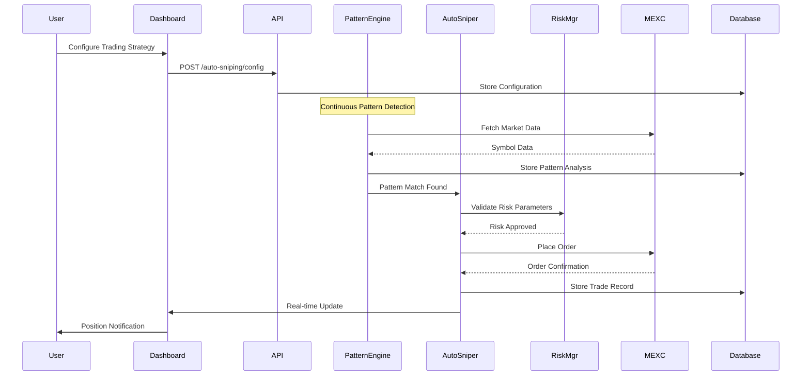
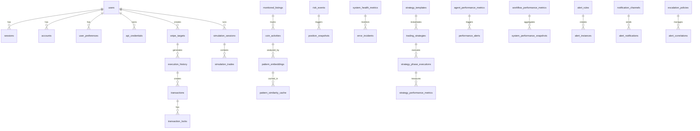
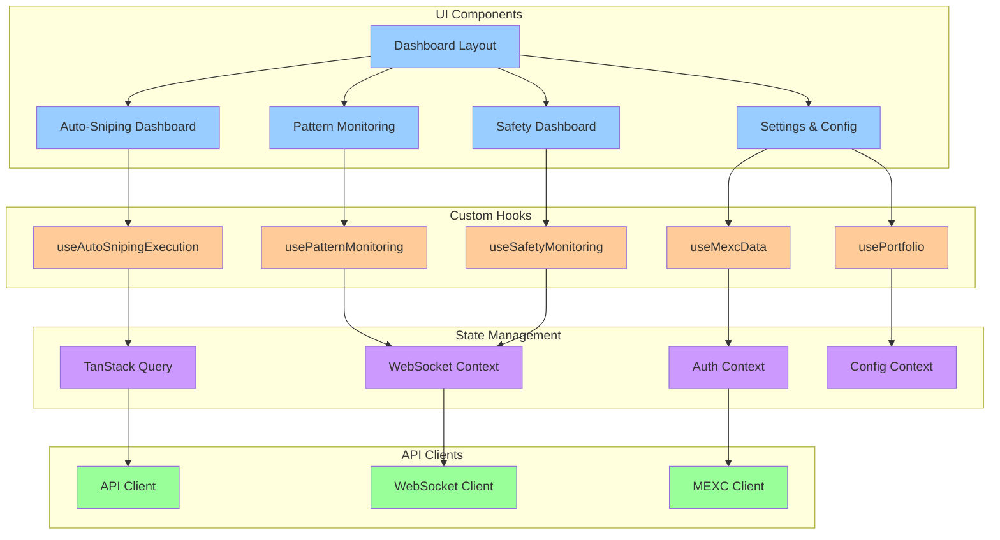
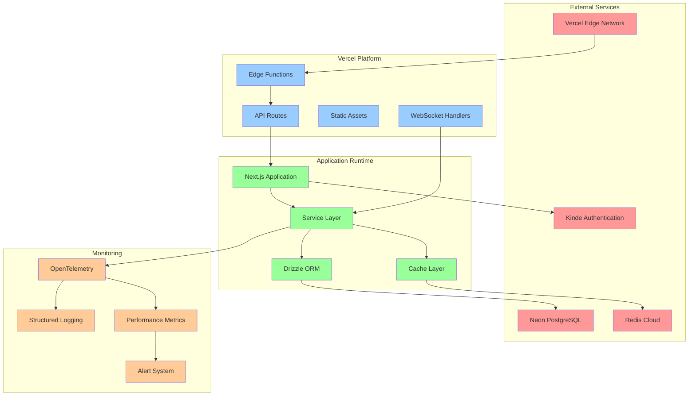

# MEXC Trading Bot - System Architecture Diagrams

## System Overview Diagram

```mermaid
graph TB
    %% External Systems
    subgraph "External Systems"
        MEXC[MEXC Exchange API]
        KINDE[Kinde Auth]
        AI[AI Services<br/>OpenAI/Perplexity]
        NEON[Neon PostgreSQL]
        VERCEL[Vercel Deployment]
    end

    %% Frontend Layer
    subgraph "Frontend Layer"
        UI[React Dashboard]
        WS[WebSocket Client]
        AUTH_UI[Auth Components]
        DASH[Trading Dashboard]
        CHARTS[Real-time Charts]
    end

    %% API Gateway Layer
    subgraph "API Gateway Layer"
        API_ROUTER[Next.js App Router]
        MIDDLEWARE[API Middleware]
        RATE_LIMIT[Rate Limiter]
        AUTH_MW[Auth Middleware]
    end

    %% Core Services Layer
    subgraph "Core Services Layer"
        %% Trading Services
        subgraph "Trading Services"
            UNIFIED_MEXC[Unified MEXC Service]
            AUTO_SNIPE[Auto-Sniping Execution]
            PATTERN_DET[Pattern Detection Engine]
            RISK_MGR[Risk Management]
            MULTI_PHASE[Multi-Phase Trading]
        end

        %% Monitoring Services  
        subgraph "Monitoring Services"
            SAFETY_MON[Safety Monitoring]
            PERF_MON[Performance Monitoring]
            ALERT_SYS[Alert System]
            HEALTH_CHECK[Health Checks]
        end

        %% Infrastructure Services
        subgraph "Infrastructure Services"
            CACHE_MGR[Cache Manager]
            WS_SERVER[WebSocket Server]
            ENCRYPTION[Encryption Service]
            CONFIG_MGR[Config Management]
        end
    end

    %% Data Layer
    subgraph "Data Layer"
        POSTGRES[(PostgreSQL<br/>Neon)]
        REDIS[(Redis Cache)]
        VECTOR_DB[(Vector Embeddings)]
        LOGS[Structured Logs]
    end

    %% Data Flow Connections
    UI --> API_ROUTER
    API_ROUTER --> MIDDLEWARE
    MIDDLEWARE --> RATE_LIMIT
    MIDDLEWARE --> AUTH_MW
    
    API_ROUTER --> UNIFIED_MEXC
    API_ROUTER --> AUTO_SNIPE
    API_ROUTER --> PATTERN_DET
    API_ROUTER --> SAFETY_MON
    
    UNIFIED_MEXC --> MEXC
    UNIFIED_MEXC --> CACHE_MGR
    AUTO_SNIPE --> RISK_MGR
    PATTERN_DET --> AI
    
    CACHE_MGR --> REDIS
    UNIFIED_MEXC --> POSTGRES
    PATTERN_DET --> VECTOR_DB
    
    AUTH_MW --> KINDE
    WS --> WS_SERVER
    HEALTH_CHECK --> VERCEL
    
    SAFETY_MON --> ALERT_SYS
    PERF_MON --> LOGS

    classDef external fill:#ff9999
    classDef frontend fill:#99ccff  
    classDef api fill:#99ff99
    classDef service fill:#ffcc99
    classDef data fill:#cc99ff

    class MEXC,KINDE,AI,NEON,VERCEL external
    class UI,WS,AUTH_UI,DASH,CHARTS frontend
    class API_ROUTER,MIDDLEWARE,RATE_LIMIT,AUTH_MW api
    class UNIFIED_MEXC,AUTO_SNIPE,PATTERN_DET,RISK_MGR,MULTI_PHASE,SAFETY_MON,PERF_MON,ALERT_SYS,HEALTH_CHECK,CACHE_MGR,WS_SERVER,ENCRYPTION,CONFIG_MGR service
    class POSTGRES,REDIS,VECTOR_DB,LOGS data
```



## Data Flow Diagram



## Service Dependencies Diagram

```mermaid
graph LR
    %% Core Dependencies
    AUTO_SNIPE[Auto-Sniping<br/>Execution Service] --> PATTERN_DET[Pattern Detection<br/>Engine]
    AUTO_SNIPE --> RISK_MGR[Risk Management<br/>Service]
    AUTO_SNIPE --> UNIFIED_MEXC[Unified MEXC<br/>Service]
    
    PATTERN_DET --> AI_INTEL[AI Intelligence<br/>Service]
    PATTERN_DET --> PATTERN_MON[Pattern Monitoring<br/>Service]
    
    UNIFIED_MEXC --> MEXC_API[MEXC API<br/>Client]
    UNIFIED_MEXC --> CACHE_MGR[Cache Manager]
    UNIFIED_MEXC --> CIRCUIT_BREAK[Circuit Breaker]
    
    RISK_MGR --> SAFETY_COORD[Safety Coordinator]
    RISK_MGR --> EMERGENCY_SYS[Emergency Safety<br/>System]
    
    %% Support Services
    CACHE_MGR --> REDIS_SVC[Redis Cache<br/>Service]
    CACHE_MGR --> ENHANCED_CACHE[Enhanced Unified<br/>Cache]
    
    SAFETY_COORD --> REAL_TIME_MON[Real-time Safety<br/>Monitoring]
    SAFETY_COORD --> ALERT_ENGINE[Alert Correlation<br/>Engine]
    
    %% Infrastructure
    MEXC_API --> RATE_LIMITER[Adaptive Rate<br/>Limiter]
    MEXC_API --> PERF_MON[Performance<br/>Monitoring]
    
    ALERT_ENGINE --> NOTIFICATION[Notification<br/>Providers]
    PERF_MON --> METRICS[System Performance<br/>Snapshots]

    classDef core fill:#ff9999
    classDef support fill:#99ccff
    classDef infra fill:#99ff99

    class AUTO_SNIPE,PATTERN_DET,UNIFIED_MEXC,RISK_MGR core
    class AI_INTEL,PATTERN_MON,CACHE_MGR,SAFETY_COORD,EMERGENCY_SYS support  
    class MEXC_API,CIRCUIT_BREAK,REDIS_SVC,ENHANCED_CACHE,REAL_TIME_MON,ALERT_ENGINE,RATE_LIMITER,PERF_MON,NOTIFICATION,METRICS infra
```

## Database Schema Relationships



## Component Architecture Diagram



## Deployment Architecture



These diagrams provide a comprehensive view of the MEXC Trading Bot architecture, showing the relationships between components, data flow, and deployment structure. The modular design ensures maintainability, scalability, and clear separation of concerns throughout the system.