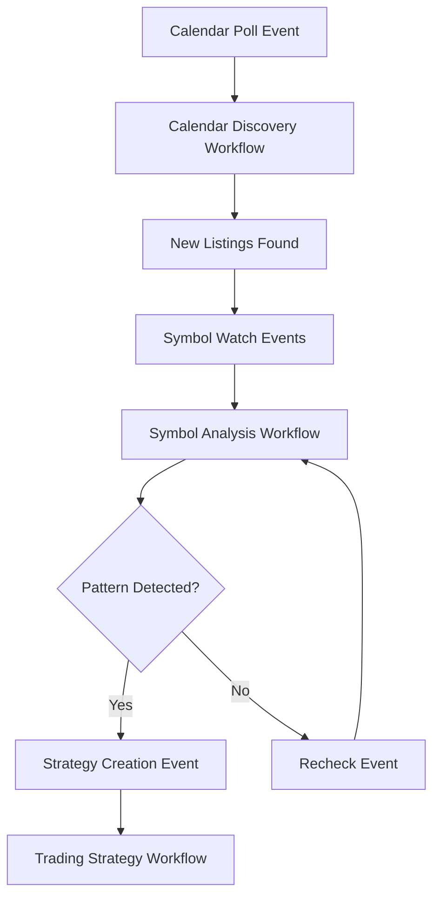

# MEXC Sniper Bot - Workflow Orchestration Guide

## Overview

The MEXC Sniper Bot uses Inngest for reliable, event-driven workflow orchestration across its 9-agent multi-agent system. This guide details the workflow architecture, configuration, and operational patterns.

## Workflow Architecture

### Core Workflow Components

1. **Inngest Client** (`src/inngest/client.ts`) - Event handling infrastructure
2. **Core Functions** (`src/inngest/functions.ts`) - Main trading workflows  
3. **Safety Functions** (`src/inngest/safety-functions.ts`) - Risk management workflows
4. **Scheduled Functions** (`src/inngest/scheduled-functions.ts`) - Automated scheduling
5. **Workflow Executor** (`src/mexc-agents/workflow-executor.ts`) - Multi-agent coordination

### Event-Driven Architecture

```typescript
// Core MEXC Events
export const mexcEvents = {
  calendarPoll: "mexc/calendar.poll.requested",
  symbolWatch: "mexc/symbol.watch.requested", 
  patternAnalysis: "mexc/pattern.analysis.requested",
  tradingStrategy: "mexc/trading.strategy.requested",
} as const;
```

## Core Workflows

### 1. Calendar Discovery Workflow

**Event:** `mexc/calendar.poll`
**Function:** `pollMexcCalendar`
**Purpose:** Multi-agent calendar discovery and new listing detection

#### Workflow Steps

```typescript
// Step 1: Execute Multi-Agent Calendar Discovery
const discoveryResult = await step.run("calendar-discovery-workflow", async () => {
  const orchestrator = new MexcOrchestrator();
  return await orchestrator.executeCalendarDiscoveryWorkflow({
    trigger,
    force,
  });
});

// Step 2: Process and send follow-up events
const followUpEvents = await step.run("process-discovery-results", async () => {
  if (discoveryData?.newListings?.length) {
    // Send symbol watch events for new discoveries
    const events = discoveryData.newListings.map(listing => ({
      name: "mexc/symbol.watch",
      data: {
        vcoinId: listing.vcoinId,
        symbolName: listing.symbolName,
        projectName: listing.projectName,
        launchTime: listing.launchTime,
        attempt: 1,
      },
    }));
    
    for (const eventData of events) {
      await inngest.send(eventData);
    }
    
    return events.length;
  }
  return 0;
});
```

#### Configuration

```typescript
interface MexcCalendarPollRequestedData {
  trigger?: string;    // "manual" | "automated" | "scheduled"
  force?: boolean;     // Force refresh even if recently polled
}
```

#### Output

```typescript
{
  status: "success",
  trigger: string,
  newListingsFound: number,
  readyTargetsFound: number,
  followUpEventsSent: number,
  timestamp: string,
  metadata: {
    agentsUsed: ["calendar", "pattern-discovery", "api"],
    analysisComplete: boolean,
  },
}
```

### 2. Symbol Monitoring Workflow

**Event:** `mexc/symbol.watch`
**Function:** `watchMexcSymbol`  
**Purpose:** Real-time symbol analysis and pattern detection

#### Workflow Steps

```typescript
// Step 1: Execute Multi-Agent Symbol Analysis
const analysisResult = await step.run("symbol-analysis-workflow", async () => {
  const orchestrator = new MexcOrchestrator();
  return await orchestrator.executeSymbolAnalysisWorkflow({
    vcoinId,
    symbolName,
    projectName,
    launchTime,
    attempt,
  });
});

// Step 2: Handle results based on symbol status
const actionResult = await step.run("process-symbol-results", async () => {
  const { symbolReady, hasCompleteData, riskLevel } = analysisData || {};
  
  if (symbolReady && hasCompleteData) {
    // Create trading strategy and target
    await inngest.send({
      name: "mexc/strategy.create",
      data: {
        vcoinId,
        symbolData: analysisData?.symbolData,
        riskLevel: riskLevel || "medium",
      },
    });
    
    return { action: "strategy_created", targetReady: true };
  } else if (attempt < 10) {
    // Schedule recheck
    await inngest.send({
      name: "mexc/symbol.watch",
      data: { vcoinId, symbolName, projectName, launchTime, attempt: attempt + 1 },
    });
    
    return { action: "recheck_scheduled", nextAttempt: attempt + 1 };
  }
  
  return { action: "max_attempts_reached", abandoned: true };
});
```

#### Configuration

```typescript
interface MexcSymbolWatchRequestedData {
  vcoinId: string;
  symbolName?: string;
  projectName?: string;
  launchTime?: string;
  attempt?: number;      // Retry attempt (max 10)
}
```

#### Pattern Detection Logic

The workflow implements intelligent retry logic based on pattern analysis:

- **Ready State Detected** (`sts:2, st:2, tt:4`) → Trigger strategy creation
- **Pre-Ready State** → Schedule recheck with exponential backoff
- **Max Attempts Reached** → Abandon monitoring

### 3. Pattern Analysis Workflow

**Event:** `mexc/patterns.analyze`
**Function:** `analyzeMexcPatterns`
**Purpose:** Advanced pattern discovery and validation

#### Configuration

```typescript
interface MexcPatternAnalysisRequestedData {
  vcoinId?: string;
  symbols?: string[];
  analysisType?: "discovery" | "monitoring" | "execution";
}
```

#### Analysis Types

1. **Discovery** - Proactive pattern scanning
2. **Monitoring** - Continuous pattern validation  
3. **Execution** - Pre-trade pattern confirmation

### 4. Trading Strategy Workflow

**Event:** `mexc/strategy.create`
**Function:** `createMexcTradingStrategy`
**Purpose:** AI-powered trading strategy generation

#### Workflow Steps

```typescript
// Step 1: Execute Multi-Agent Trading Strategy Creation
const strategyResult = await step.run("trading-strategy-workflow", async () => {
  const orchestrator = new MexcOrchestrator();
  return await orchestrator.executeTradingStrategyWorkflow({
    vcoinId,
    symbolData,
    riskLevel,
    capital,
  });
});
```

#### Configuration

```typescript
interface MexcTradingStrategyRequestedData {
  vcoinId: string;
  symbolData: {
    symbol?: string;
    price?: number;
    volume?: number;
    [key: string]: unknown;
  };
  riskLevel?: "low" | "medium" | "high";
  capital?: number;
}
```

#### Output

```typescript
{
  status: "success",
  vcoinId: string,
  strategyCreated: boolean,
  entryPrice?: number,
  stopLoss?: number,
  takeProfit?: number,
  positionSize?: number,
  riskRewardRatio?: number,
  timestamp: string,
  metadata: {
    agentsUsed: ["trading-strategy", "risk-management", "market-analysis"],
    riskLevel: string,
    capital: number,
  },
}
```

## Safety Workflows

### Emergency Safety Functions

The system includes comprehensive safety workflows for risk management:

```typescript
// Emergency halt workflow
export const emergencyHalt = inngest.createFunction(
  { id: "emergency-halt" },
  { event: "safety/emergency.halt" },
  async ({ event, step }) => {
    // 1. Halt all new trading
    // 2. Assess current positions  
    // 3. Execute emergency exit if needed
    // 4. Notify administrators
  }
);

// Risk threshold monitoring
export const riskMonitoring = inngest.createFunction(
  { id: "risk-monitoring" },
  { event: "safety/risk.monitor" },
  async ({ event, step }) => {
    // 1. Calculate current risk metrics
    // 2. Check circuit breaker thresholds
    // 3. Trigger warnings or halts
    // 4. Update risk dashboard
  }
);
```

## Workflow Execution Context

### Execution Tracking

```typescript
interface WorkflowExecutionContext {
  startTime: number;
  agentsUsed: string[];
  stepCount: number;
  currentStep: string;
}

// Context creation for workflow tracking
private createExecutionContext(workflowType: string): WorkflowExecutionContext {
  return {
    startTime: Date.now(),
    agentsUsed: [],
    stepCount: 0,
    currentStep: "initialization",
  };
}
```

### Metrics Collection

```typescript
interface AgentOrchestrationMetrics {
  totalExecutions: number;
  successRate: number;
  averageDuration: number;
  errorRate: number;
  lastExecution: string;
}

// Metrics update after workflow completion
private updateMetrics(result: MexcWorkflowResult, startTime: number): void {
  const duration = Date.now() - startTime;
  
  // Update success/error rates
  if (result.success) {
    const successCount = Math.round(this.metrics.successRate * (this.metrics.totalExecutions - 1));
    this.metrics.successRate = (successCount + 1) / this.metrics.totalExecutions;
  } else {
    const errorCount = Math.round(this.metrics.errorRate * (this.metrics.totalExecutions - 1));
    this.metrics.errorRate = (errorCount + 1) / this.metrics.totalExecutions;
  }
  
  // Update average duration
  const totalDuration = this.metrics.averageDuration * (this.metrics.totalExecutions - 1);
  this.metrics.averageDuration = (totalDuration + duration) / this.metrics.totalExecutions;
  
  this.metrics.lastExecution = new Date().toISOString();
}
```

## Agent Coordination Patterns

### Sequential Agent Execution

```typescript
// Calendar discovery workflow - sequential execution
async executeCalendarDiscoveryWorkflow(request) {
  // Step 1: Data fetching (MexcApiAgent)
  const calendarData = await this.dataFetcher.fetchCalendarData();
  
  // Step 2: Calendar analysis (CalendarAgent)
  const calendarAnalysis = await this.agentManager
    .getCalendarAgent()
    .scanForNewListings(calendarEntries);
  
  // Step 3: Pattern discovery (PatternDiscoveryAgent)
  const patternAnalysis = await this.agentManager
    .getPatternDiscoveryAgent()
    .analyzePatterns(calendarAnalysis);
  
  // Step 4: Result synthesis (Orchestrator)
  return this.synthesizeResults(calendarAnalysis, patternAnalysis);
}
```

### Parallel Agent Execution

```typescript
// Health checks - parallel execution
async checkAgentHealth() {
  const [mexcHealth, openAiHealth, dbHealth] = await Promise.allSettled([
    checkMexcApiHealth(),
    checkOpenAiHealth(),
    checkDatabaseHealth(),
  ]);
  
  const agentHealthChecks = await Promise.allSettled([
    Promise.resolve(mexcApiStatus !== "unhealthy"),
    Promise.resolve(openAiStatus !== "unhealthy"),
    // ... other agent health checks
  ]);
  
  return this.synthesizeHealthResults(agentHealthChecks);
}
```

## Event Flow Architecture

### Event Cascade Pattern



### Event Handling Configuration

```typescript
// Event type safety
interface InngestStep {
  run: (id: string, fn: () => Promise<unknown>) => Promise<unknown>;
}

// Type guards for event data validation
function isAgentWorkflowResult(value: unknown): value is AgentWorkflowResult {
  return (
    typeof value === "object" &&
    value !== null &&
    typeof (value as AgentWorkflowResult).success === "boolean"
  );
}
```

## Error Handling and Recovery

### Workflow Error Patterns

```typescript
// Workflow-level error handling
try {
  const result = await this.workflowExecutor.executeCalendarDiscoveryWorkflow(request);
  this.updateMetrics(result, startTime);
  return result;
} catch (error) {
  console.error("[MexcOrchestrator] Calendar discovery workflow failed:", error);
  const errorResult = {
    success: false,
    error: error instanceof Error ? error.message : "Unknown error",
    metadata: {
      agentsUsed: ["mexc-api", "calendar", "pattern-discovery"],
    },
  };
  this.updateMetrics(errorResult, startTime);
  return errorResult;
}
```

### Retry Logic

```typescript
// Intelligent retry with exponential backoff
if (attempt < 10) {
  // Schedule recheck with delay based on attempt number
  const delay = Math.min(1000 * Math.pow(2, attempt), 300000); // Max 5 minutes
  
  await inngest.send({
    name: "mexc/symbol.watch",
    data: {
      vcoinId,
      symbolName,
      projectName,
      launchTime,
      attempt: attempt + 1,
    },
    delay: `${delay}ms`,
  });
}
```

## Development and Testing

### Local Development Setup

```bash
# Start Next.js application
npm run dev

# Start Inngest dev server
npx inngest-cli dev -u http://localhost:3008/api/inngest

# Access Inngest dashboard
open http://localhost:8288
```

### Workflow Testing

```typescript
// Manual workflow triggers for testing
export const testCalendarPoll = async () => {
  await inngest.send({
    name: "mexc/calendar.poll",
    data: { trigger: "manual", force: true },
  });
};

export const testSymbolWatch = async (vcoinId: string) => {
  await inngest.send({
    name: "mexc/symbol.watch", 
    data: { vcoinId, attempt: 1 },
  });
};
```

### Debug Configuration

```typescript
// Workflow status updates for debugging
async function updateWorkflowStatus(action: string, data: unknown) {
  try {
    const response = await fetch("http://localhost:3008/api/workflow-status", {
      method: "POST",
      headers: { "Content-Type": "application/json" },
      body: JSON.stringify({ action, data }),
    });
    
    if (!response.ok) {
      console.warn("Failed to update workflow status:", response.statusText);
    }
  } catch (error) {
    console.warn("Error updating workflow status:", error);
  }
}
```

## Production Deployment

### Vercel Configuration

```json
{
  "functions": {
    "app/api/inngest/route.ts": {
      "maxDuration": 300
    }
  },
  "crons": [
    {
      "path": "/api/triggers/calendar-poll",
      "schedule": "*/15 * * * *"
    }
  ]
}
```

### Environment Variables

```bash
# Required for workflow execution
INNGEST_SIGNING_KEY=your-signing-key
INNGEST_EVENT_KEY=your-event-key

# Agent dependencies
OPENAI_API_KEY=your-openai-key
MEXC_API_KEY=your-mexc-key
MEXC_SECRET_KEY=your-mexc-secret

# Database
DATABASE_URL=your-database-url
```

### Performance Optimization

```typescript
// Workflow timeout configuration
const WORKFLOW_TIMEOUT = 5 * 60 * 1000; // 5 minutes

// Batch event processing
const batchEventSending = async (events: Event[]) => {
  const batches = chunk(events, 10); // Process in batches of 10
  
  for (const batch of batches) {
    await Promise.all(batch.map(event => inngest.send(event)));
    await delay(100); // Rate limiting
  }
};
```

## Monitoring and Observability

### Workflow Metrics

```typescript
interface WorkflowMetrics {
  totalWorkflows: number;
  activeWorkflows: number;
  successfulWorkflows: number;
  failedWorkflows: number;
  averageExecutionTime: number;
  lastExecution: string;
}
```

### Health Monitoring

```typescript
// Comprehensive system health check
async healthCheck(): Promise<boolean> {
  try {
    const agentHealth = await this.agentManager.checkAgentHealth();
    const dataFetcherHealth = await this.dataFetcher.healthCheck();
    
    return Object.values(agentHealth).some(healthy => healthy) && dataFetcherHealth;
  } catch (error) {
    console.error("[MexcOrchestrator] Health check failed:", error);
    return false;
  }
}
```

### Alerting Configuration

```typescript
// Critical workflow failure alerts
if (this.metrics.errorRate > 0.25) {
  await inngest.send({
    name: "safety/alert.critical",
    data: {
      type: "high_error_rate",
      errorRate: this.metrics.errorRate,
      timestamp: new Date().toISOString(),
    },
  });
}
```

## Best Practices

### Workflow Design Principles

1. **Idempotency** - Workflows can be safely retried
2. **Atomicity** - Each step is self-contained  
3. **Observability** - Comprehensive logging and metrics
4. **Fault Tolerance** - Graceful error handling and recovery
5. **Performance** - Efficient resource utilization

### Event Design Guidelines

1. **Type Safety** - Strong typing for all event data
2. **Validation** - Input validation and type guards
3. **Versioning** - Future-proof event schema design
4. **Documentation** - Clear event contracts and examples

### Error Handling Standards

1. **Structured Errors** - Consistent error format across workflows
2. **Retry Logic** - Intelligent retry with exponential backoff
3. **Circuit Breakers** - Prevent cascade failures
4. **Monitoring** - Comprehensive error tracking and alerting

This workflow orchestration guide provides complete coverage of the MEXC Sniper Bot's event-driven architecture, enabling developers to effectively understand, modify, and optimize the multi-agent workflow system.