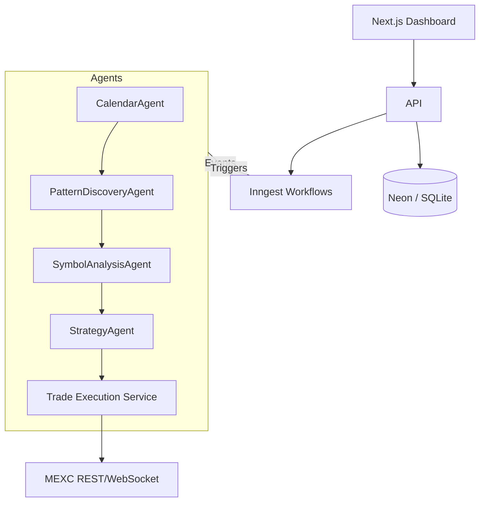

# System Patterns

## Architecture Overview
- **Hexagonal (Ports & Adapters)** – Core domain logic isolated from infrastructure (exchange APIs, databases, UI).
- **Event-Driven Orchestration** – Inngest workflows trigger agent pipelines (calendar discovery → pattern detection → strategy exec).
- **Multi-Agent Orchestration Layer** – `MultiAgentOrchestrator` coordinates specialised TypeScript agents via message-passing.
- **CQRS + Event Sourcing (Lightweight)** – Read models for dashboard metrics, event stream for trade/audit history.
- **Edge-Optimised API Routes** – Next.js Route Handlers deployed on Vercel Edge for low-latency trading actions.
- **Observability Pillars** – OpenTelemetry tracing + structured logging; metrics exported to Grafana/Prometheus.

## Key Design Decisions
| Decision | Rationale |
|----------|-----------|
| **Bun** over npm/yarn | Faster installs & script execution; aligns with CLAUDE.md workflow |
| **Drizzle ORM** | Type-safe schema & migrations; works with NeonDB & SQLite |
| **Dual Auth** (Kinde + Supabase) | Kinde (primary, simple OAuth); Supabase (migration/secondary) |
| **TanStack Query v5** | Declarative data fetching/state; avoids bespoke fetch logic |
| **Stagehand v2** | AI-powered E2E testing; GPT-4 autonomous browser interaction |
| **Memory Bank** | Cline pattern for persistent AI agent knowledge across sessions |
| **OpenTelemetry** | Comprehensive observability with distributed tracing |
| **File <500 LOC** | Maintain readability, enforce modularity |

## Component Relationships

## Critical Implementation Paths
1. **Listing Detection** → **Pattern Validation** → **Confidence Scoring** → **Strategy Generation** → **Trade Execution**
2. **Safety Monitoring** (RiskManagerAgent) interrupting execution via circuit breakers.
3. **Telemetry Propagation** from agents to OpenTelemetry exporter.

## Extension Points
- Add new agent types via shared `AgentBase` interface.
- Plug additional exchanges by implementing `ExchangeAdapter` port.
- Custom workflows via Inngest event names.
