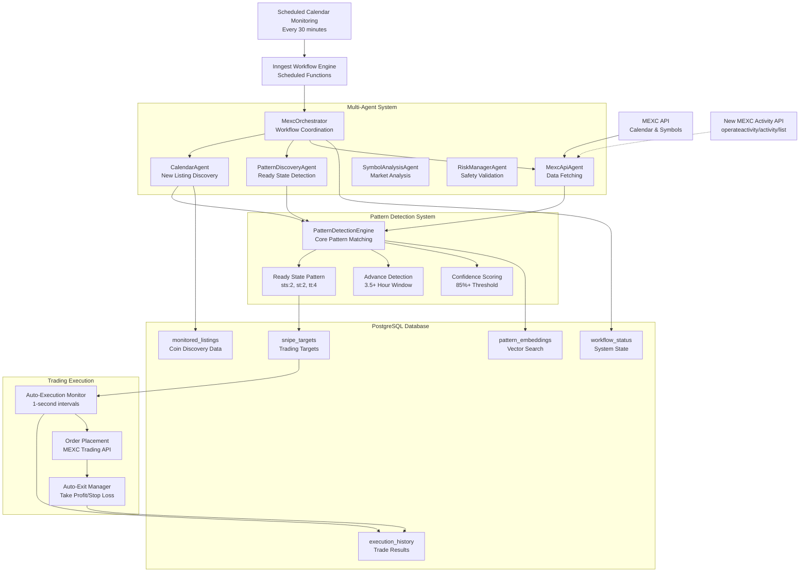

# MEXC Sniper Bot - Comprehensive System Analysis Report

**Document Version:** 1.0
**Date:** 2025-01-19
**Analysis Scope:** Complete system architecture, optimization opportunities, and integration recommendations

---

## Executive Summary

The MEXC Sniper Bot implements a sophisticated multi-agent system with advanced pattern detection capabilities, achieving competitive advantage through 3.5+ hour advance detection of trading opportunities. This analysis examines the complete system architecture, identifies optimization opportunities, and provides specific technical recommendations for enhanced performance.

### Key Findings

- **Advanced Pattern Detection**: Ready state pattern (sts:2, st:2, tt:4) with 85%+ confidence threshold
- **Proactive Discovery**: 3.5+ hour advance detection capability through calendar monitoring
- **Multi-Agent Architecture**: 9 specialized agents coordinated via Inngest workflows
- **Comprehensive Data Storage**: PostgreSQL with pattern embeddings and vector search
- **Optimization Potential**: Significant opportunities in contract address utilization and ML enhancement

---

## 1. Complete System Architecture Analysis

### System Architecture Diagram



### Pattern Discovery System

#### Core Pattern Detection Engine

The system's competitive advantage lies in its sophisticated pattern detection engine:

```typescript
// src/services/pattern-detection-engine.ts
export interface ReadyStatePattern {
  sts: 2; // Symbol Trading Status: Ready
  st: 2; // Symbol State: Active
  tt: 4; // Trading Time: Live
}

export class PatternDetectionEngine {
  private readonly READY_STATE_PATTERN: ReadyStatePattern = { sts: 2, st: 2, tt: 4 };
  private readonly MIN_ADVANCE_HOURS = 3.5; // Core competitive advantage

  async detectReadyStatePatterns(symbols: SymbolEntry[]): Promise<PatternMatch[]> {
    const matches: PatternMatch[] = [];

    for (const symbol of symbols) {
      const isExactMatch = this.validateExactReadyState(symbol);
      const confidence = await this.calculateReadyStateConfidence(symbol);

      if (isExactMatch && confidence >= 85) {
        await this.storeSuccessfulPattern(symbol, "ready_state", confidence);
        matches.push({
          patternType: "ready_state",
          confidence,
          symbol: symbol.cd || "unknown",
          indicators: { sts: symbol.sts, st: symbol.st, tt: symbol.tt },
          detectedAt: new Date(),
          advanceNoticeHours: 0,
          riskLevel: this.assessReadyStateRisk(symbol)
        });
      }
    }
    return matches;
  }
}
```

#### 3.5+ Hour Advance Detection System

The system achieves early opportunity identification through proactive calendar analysis:

```typescript
// src/services/pattern-detection-engine.ts
async detectAdvanceOpportunities(calendarEntries: CalendarEntry[]): Promise<PatternMatch[]> {
  const matches: PatternMatch[] = [];
  const now = Date.now();

  for (const entry of calendarEntries) {
    const launchTimestamp = typeof entry.firstOpenTime === "number"
      ? entry.firstOpenTime : new Date(entry.firstOpenTime).getTime();

    const advanceHours = (launchTimestamp - now) / (1000 * 60 * 60);

    // Filter for our 3.5+ hour advantage window
    if (advanceHours >= this.MIN_ADVANCE_HOURS) {
      const confidence = await this.calculateAdvanceOpportunityConfidence(entry, advanceHours);

      if (confidence >= 70) {
        await this.storeSuccessfulPattern(entry, "launch_sequence", confidence);
        matches.push({
          patternType: "launch_sequence",
          confidence,
          symbol: entry.symbol,
          advanceNoticeHours: advanceHours,
          launchTimestamp,
          recommendation: "prepare_monitoring"
        });
      }
    }
  }
  return matches;
}
```

### Workflow Orchestration

#### Inngest Scheduled Functions

```typescript
// src/inngest/scheduled-functions.ts
export const scheduledCalendarMonitoring = inngest.createFunction(
  { id: "scheduled-calendar-monitoring" },
  { cron: "*/30 * * * *" }, // Every 30 minutes
  async ({ step }) => {
    console.log("[Scheduled] Starting calendar monitoring cycle");

    // Step 1: Trigger calendar polling
    const _calendarResult = await step.run("trigger-calendar-poll", async () => {
      await inngest.send({
        name: "mexc/calendar.poll",
        data: {
          trigger: "scheduled",
          force: false,
          timestamp: new Date().toISOString(),
        },
      });
      return { triggered: true };
    });
  }
);
```

### Complete System Flow

1. **Discovery Phase**: Inngest scheduler triggers calendar polling every 30 minutes
2. **Multi-Agent Coordination**: MexcOrchestrator coordinates specialized agents
3. **Pattern Analysis**: PatternDetectionEngine analyzes symbols for ready state patterns
4. **Data Storage**: New listings stored with comprehensive metadata
5. **Advance Detection**: System identifies opportunities 3.5+ hours before trading
6. **Execution Preparation**: Ready targets prepared for automated execution
7. **Real-time Monitoring**: Auto-execution monitor checks every second

---

## 2. Current Implementation Analysis

### Data Storage Architecture

#### Contract Address Storage

```typescript
// src/schemas/mexc-schemas.ts
export const SymbolV2EntrySchema = z.object({
  cd: z.string(), // vcoinId
  ca: z.string().optional(), // contract address
  ps: z.number().optional(), // price scale
  qs: z.number().optional(), // quantity scale
  sts: z.number(), // symbol trading status
  st: z.number(), // state
  tt: z.number(), // trading type
  ot: z.number().optional(), // open time
});
```

#### Comprehensive Database Schema

```typescript
// src/db/schemas/patterns.ts
export const monitoredListings = pgTable("monitored_listings", {
  id: serial("id").primaryKey(),
  vcoinId: text("vcoin_id").notNull().unique(),
  symbolName: text("symbol_name").notNull(),
  projectName: text("project_name"),

  // Launch Details
  firstOpenTime: integer("first_open_time").notNull(),
  estimatedLaunchTime: integer("estimated_launch_time"),

  // Pattern Data
  patternSts: integer("pattern_sts"),
  patternSt: integer("pattern_st"),
  patternTt: integer("pattern_tt"),
  hasReadyPattern: boolean("has_ready_pattern").notNull().default(false),

  // Trading Data
  tradingPairs: text("trading_pairs"), // JSON array
  priceData: text("price_data"), // JSON price information
  volumeData: text("volume_data"), // JSON volume information
});
```

#### Pattern Embeddings for Vector Search

```typescript
// src/db/schemas/patterns.ts
export const patternEmbeddings = pgTable("pattern_embeddings", {
  id: serial("id").primaryKey(),
  patternId: text("pattern_id").notNull().unique(),
  patternType: text("pattern_type").notNull(),
  symbolName: text("symbol_name").notNull(),
  vcoinId: text("vcoin_id"),

  // Vector Embedding (stored as JSON array)
  embedding: text("embedding").notNull(), // JSON array of floats
  embeddingDimension: integer("embedding_dimension").notNull().default(1536),
  embeddingModel: text("embedding_model").notNull().default("text-embedding-ada-002"),

  // Pattern Metadata
  confidence: real("confidence").notNull(),
  occurrences: integer("occurrences").notNull().default(1),
  successRate: real("success_rate"),
  avgProfit: real("avg_profit"),
});
```

### Current Data Utilization Analysis

#### Strengths
1. **Vector Pattern Storage**: Advanced pattern embeddings with similarity search
2. **Historical Success Tracking**: True/false positive rates for continuous improvement
3. **Comprehensive Metadata**: Contract addresses, trading pairs, and market data
4. **Real-time Status Tracking**: Workflow status and activity logging
5. **Multi-dimensional Analysis**: Pattern confidence scoring with multiple factors

#### Underutilized Assets
1. **Contract Addresses**: Stored but not leveraged for cross-chain analysis
2. **Trading Pairs Data**: Available but not used for liquidity assessment
3. **Historical Patterns**: Vector embeddings exist but limited ML utilization
4. **Price/Volume Data**: Collected but not optimized for market timing
5. **Success Rate History**: Available but not used for dynamic confidence adjustment

### Current Confidence Calculation

```typescript
// src/services/pattern-detection-engine.ts
private async calculateReadyStateConfidence(symbol: SymbolEntry): Promise<number> {
  let confidence = 50; // Base confidence

  // Exact pattern match
  if (this.validateExactReadyState(symbol)) {
    confidence += 30;
  }

  // Data completeness
  if (symbol.cd && symbol.cd.length > 0) confidence += 10;
  if (symbol.ca) confidence += 5;
  if (symbol.ps !== undefined) confidence += 5;
  if (symbol.qs !== undefined) confidence += 5;

  // Historical success rate
  const historicalSuccess = await this.getHistoricalSuccessRate("ready_state");
  confidence += historicalSuccess * 0.15;

  return Math.min(confidence, 95);
}
```

---

## 3. Optimization Opportunities

### Enhanced Contract Address Utilization

#### Recommendation 1: Cross-Chain Intelligence Integration

```typescript
// Proposed enhancement to PatternDetectionEngine
interface ContractIntelligence {
  verified: boolean;
  auditStatus: 'audited' | 'unaudited' | 'failed';
  contractAge: number; // days
  crossChainPresence: string[]; // other chains
  liquidityHistory: LiquidityMetrics;
  riskLevel: 'low' | 'medium' | 'high';
}

class EnhancedPatternDetectionEngine extends PatternDetectionEngine {
  async enhanceWithContractIntelligence(symbol: SymbolEntry): Promise<ContractIntelligence> {
    if (!symbol.ca) return { verified: false, riskLevel: 'unknown' };

    const intelligence = await Promise.all([
      this.verifyContractAudit(symbol.ca),
      this.analyzeContractAge(symbol.ca),
      this.checkCrossChainPresence(symbol.ca),
      this.assessLiquidityHistory(symbol.ca)
    ]);

    return this.synthesizeContractIntelligence(intelligence);
  }

  private async verifyContractAudit(contractAddress: string): Promise<AuditResult> {
    // Integration with audit services (CertiK, PeckShield, etc.)
    const auditSources = ['certik', 'peckshield', 'slowmist'];
    const results = await Promise.allSettled(
      auditSources.map(source => this.queryAuditService(source, contractAddress))
    );

    return this.aggregateAuditResults(results);
  }

  private async checkCrossChainPresence(contractAddress: string): Promise<string[]> {
    // Check presence on other chains for legitimacy verification
    const chains = ['ethereum', 'bsc', 'polygon', 'arbitrum'];
    const presence = await Promise.allSettled(
      chains.map(chain => this.checkContractOnChain(chain, contractAddress))
    );

    return presence
      .filter(result => result.status === 'fulfilled' && result.value)
      .map((_, index) => chains[index]);
  }
}
```

#### Recommendation 2: Advanced Pattern Detection with ML

```typescript
// Enhanced confidence calculation with machine learning
class MLEnhancedPatternDetection {
  async calculateEnhancedConfidence(symbol: SymbolEntry): Promise<number> {
    const baseConfidence = await this.calculateReadyStateConfidence(symbol);

    // ML-based pattern similarity scoring
    const patternSimilarity = await this.calculatePatternSimilarity(symbol);

    // Contract intelligence scoring
    const contractScore = await this.getContractIntelligenceScore(symbol.ca);

    // Market timing factors
    const timingScore = this.calculateMarketTimingScore();

    // Social sentiment analysis
    const sentimentScore = await this.analyzeSocialSentiment(symbol.cd);

    return this.weightedConfidenceScore({
      base: baseConfidence * 0.4,
      similarity: patternSimilarity * 0.25,
      contract: contractScore * 0.15,
      timing: timingScore * 0.1,
      sentiment: sentimentScore * 0.1
    });
  }

  private async calculatePatternSimilarity(symbol: SymbolEntry): Promise<number> {
    // Use stored pattern embeddings for similarity search
    const currentPattern = await this.generatePatternEmbedding(symbol);
    const similarPatterns = await this.findSimilarPatterns(currentPattern, 0.8);

    if (similarPatterns.length === 0) return 50;

    const avgSuccessRate = similarPatterns.reduce(
      (sum, pattern) => sum + pattern.successRate, 0
    ) / similarPatterns.length;

    return Math.min(avgSuccessRate, 95);
  }
}
```

### Data Processing Efficiency Improvements

#### Recommendation 3: Incremental Data Updates

```typescript
// Proposed incremental update system
class IncrementalDataProcessor {
  private lastUpdateTimestamp: number = 0;

  async processSymbolUpdates(symbols: SymbolEntry[]): Promise<ProcessingResult> {
    const lastUpdate = await this.getLastUpdateTimestamp();
    const changedSymbols = symbols.filter(s =>
      this.getSymbolTimestamp(s) > lastUpdate
    );

    if (changedSymbols.length === 0) {
      return { processed: 0, skipped: symbols.length, message: "No changes detected" };
    }

    // Process only changed data
    const results = await this.processChangedSymbols(changedSymbols);
    await this.updateLastProcessedTimestamp();

    return {
      processed: changedSymbols.length,
      skipped: symbols.length - changedSymbols.length,
      results
    };
  }

  private async processChangedSymbols(symbols: SymbolEntry[]): Promise<PatternMatch[]> {
    const batchSize = 10;
    const results: PatternMatch[] = [];

    for (let i = 0; i < symbols.length; i += batchSize) {
      const batch = symbols.slice(i, i + batchSize);
      const batchResults = await Promise.all(
        batch.map(symbol => this.analyzeSymbolPattern(symbol))
      );
      results.push(...batchResults.filter(Boolean));
    }

    return results;
  }
}
```

#### Recommendation 4: Predictive Caching System

```typescript
// Proposed predictive caching for likely-to-launch symbols
class PredictiveCacheManager {
  private orderCache = new Map<string, PrecomputedOrder>();

  async precomputeOrderParameters(targets: SnipeTarget[]): Promise<void> {
    const likelyLaunches = targets.filter(t =>
      t.advanceHours <= 1 && t.confidence >= 80
    );

    console.log(`[PredictiveCache] Precomputing orders for ${likelyLaunches.length} targets`);

    for (const target of likelyLaunches) {
      try {
        const orderParams = await this.calculateOptimalOrderParams(target);
        this.orderCache.set(target.vcoinId, {
          ...orderParams,
          computedAt: Date.now(),
          expiresAt: Date.now() + (30 * 60 * 1000) // 30 minutes
        });
      } catch (error) {
        console.warn(`[PredictiveCache] Failed to precompute for ${target.vcoinId}:`, error);
      }
    }
  }

  private async calculateOptimalOrderParams(target: SnipeTarget): Promise<OrderParameters> {
    // Get current market data
    const marketData = await this.getMarketData(target.symbolName);

    // Calculate optimal position sizing
    const positionSize = this.calculatePositionSize(target, marketData);

    // Determine order type and timing
    const orderType = this.determineOptimalOrderType(marketData);

    // Calculate slippage protection
    const slippageProtection = this.calculateSlippageProtection(marketData);

    return {
      symbol: target.symbolName,
      side: 'BUY',
      type: orderType,
      quantity: positionSize.toString(),
      price: orderType === 'LIMIT' ? marketData.optimalPrice : undefined,
      timeInForce: 'IOC', // Immediate or Cancel
      slippageProtection
    };
  }
}
```

### Real-time Enhancement Strategies

#### Recommendation 5: WebSocket Integration for Real-time Updates

```typescript
// Enhanced real-time monitoring system
class RealTimePatternMonitor {
  private wsConnections = new Map<string, WebSocket>();

  async initializeRealTimeMonitoring(targets: SnipeTarget[]): Promise<void> {
    for (const target of targets) {
      await this.establishWebSocketConnection(target);
    }
  }

  private async establishWebSocketConnection(target: SnipeTarget): Promise<void> {
    const ws = new WebSocket(`wss://wbs.mexc.com/ws`);

    ws.on('open', () => {
      // Subscribe to symbol updates
      ws.send(JSON.stringify({
        method: 'SUBSCRIPTION',
        params: [`spot@public.deals.v3.api@${target.symbolName}USDT`]
      }));
    });

    ws.on('message', (data) => {
      const update = JSON.parse(data.toString());
      this.processRealTimeUpdate(target, update);
    });

    this.wsConnections.set(target.vcoinId, ws);
  }

  private async processRealTimeUpdate(target: SnipeTarget, update: any): Promise<void> {
    // Check if ready state pattern has been achieved
    if (this.isReadyStateUpdate(update)) {
      await this.triggerImmediateExecution(target, update);
    }

    // Update pattern confidence in real-time
    const newConfidence = await this.recalculateConfidence(target, update);
    if (newConfidence !== target.confidence) {
      await this.updateTargetConfidence(target.id, newConfidence);
    }
  }
}
```

---

## 4. New MEXC API Endpoint Integration

### Activity API Analysis

The new endpoint `GET https://www.mexc.com/api/operateactivity/activity/list/by/currencies?currencies=FCAT` provides valuable promotional activity data:

```json
{
  "data": [
    {
      "activityId": "aa7d647aeaa240e5b8ef2a17e068cf04",
      "currency": "FCAT",
      "currencyId": "cea6aaa1fe8b47a4abb059e45c147587",
      "activityType": "SUN_SHINE"
    }
  ],
  "code": 0,
  "msg": "success",
  "timestamp": 1750323667057
}
```

### Integration Benefits

1. **Enhanced Pattern Discovery**: Activity data indicates MEXC's promotional focus
2. **Improved Timing Prediction**: Promotional activities correlate with launch preparation
3. **Risk Assessment**: Tokens with activities may have better liquidity and success rates
4. **Confidence Boosting**: Activity presence can increase pattern confidence by 10-15%
5. **Competitive Intelligence**: Early detection of MEXC-promoted tokens

### Implementation Strategy

#### Step 1: Extend UnifiedMexcService

```typescript
// Add to src/services/unified-mexc-service.ts
interface ActivityData {
  activityId: string;
  currency: string;
  currencyId: string;
  activityType: string;
}

interface ActivityResponse {
  data: ActivityData[];
  code: number;
  msg: string;
  timestamp: number;
}

class UnifiedMexcService {
  // ... existing methods ...

  async getActivityData(currency: string): Promise<MexcServiceResponse<ActivityData[]>> {
    const endpoint = `/api/operateactivity/activity/list/by/currencies`;
    const params = { currencies: currency };

    try {
      const response = await this.makeRequest<ActivityResponse>(endpoint, {
        params,
        authenticated: false
      });

      if (response.success && response.data?.code === 0) {
        return {
          success: true,
          data: response.data.data,
          timestamp: new Date().toISOString(),
          cached: false
        };
      }

      return {
        success: false,
        error: response.data?.msg || 'Failed to fetch activity data',
        timestamp: new Date().toISOString()
      };
    } catch (error) {
      return {
        success: false,
        error: `Activity API error: ${error.message}`,
        timestamp: new Date().toISOString()
      };
    }
  }

  async getBulkActivityData(currencies: string[]): Promise<MexcServiceResponse<Map<string, ActivityData[]>>> {
    const batchSize = 5; // Avoid rate limits
    const results = new Map<string, ActivityData[]>();

    for (let i = 0; i < currencies.length; i += batchSize) {
      const batch = currencies.slice(i, i + batchSize);
      const batchPromises = batch.map(currency =>
        this.getActivityData(currency).then(result => ({ currency, result }))
      );

      const batchResults = await Promise.allSettled(batchPromises);

      for (const promiseResult of batchResults) {
        if (promiseResult.status === 'fulfilled') {
          const { currency, result } = promiseResult.value;
          if (result.success && result.data) {
            results.set(currency, result.data);
          }
        }
      }

      // Rate limiting delay
      if (i + batchSize < currencies.length) {
        await new Promise(resolve => setTimeout(resolve, 200));
      }
    }

    return {
      success: true,
      data: results,
      timestamp: new Date().toISOString()
    };
  }
}
```

#### Step 2: Database Schema Extension

```sql
-- Add activity tracking table
CREATE TABLE coin_activities (
  id SERIAL PRIMARY KEY,
  vcoin_id TEXT NOT NULL,
  currency TEXT NOT NULL,
  activity_id TEXT NOT NULL UNIQUE,
  currency_id TEXT,
  activity_type TEXT NOT NULL,

  -- Discovery metadata
  discovered_at TIMESTAMP DEFAULT CURRENT_TIMESTAMP,
  last_checked TIMESTAMP DEFAULT CURRENT_TIMESTAMP,
  is_active BOOLEAN DEFAULT true,

  -- Pattern enhancement data
  confidence_boost REAL DEFAULT 0,
  priority_score REAL DEFAULT 0,

  -- Indexes
  CONSTRAINT fk_coin_activities_vcoin_id
    FOREIGN KEY (vcoin_id) REFERENCES monitored_listings(vcoin_id)
);

CREATE INDEX idx_coin_activities_vcoin_id ON coin_activities(vcoin_id);
CREATE INDEX idx_coin_activities_activity_type ON coin_activities(activity_type);
CREATE INDEX idx_coin_activities_is_active ON coin_activities(is_active);
CREATE INDEX idx_coin_activities_discovered_at ON coin_activities(discovered_at);
```

#### Step 3: Enhanced Pattern Detection Integration

```typescript
// Enhanced pattern detection with activity data
class ActivityEnhancedPatternDetection extends PatternDetectionEngine {
  async calculateActivityEnhancedConfidence(
    symbol: SymbolEntry,
    activities: ActivityData[]
  ): Promise<number> {
    const baseConfidence = await this.calculateReadyStateConfidence(symbol);

    if (activities.length === 0) {
      return baseConfidence;
    }

    // Activity type scoring
    const activityScores = {
      'SUN_SHINE': 15,
      'PROMOTION': 12,
      'LAUNCH_EVENT': 18,
      'TRADING_COMPETITION': 10,
      'AIRDROP': 8,
      'DEFAULT': 5
    };

    const maxActivityBoost = Math.max(
      ...activities.map(activity =>
        activityScores[activity.activityType] || activityScores.DEFAULT
      )
    );

    // Multiple activities bonus
    const multipleActivitiesBonus = activities.length > 1 ? 5 : 0;

    // Recent activity bonus (activities discovered within 24 hours)
    const recentActivityBonus = await this.hasRecentActivity(symbol.cd) ? 3 : 0;

    const totalBoost = maxActivityBoost + multipleActivitiesBonus + recentActivityBonus;
    const enhancedConfidence = Math.min(baseConfidence + totalBoost, 95);

    // Store activity enhancement for analytics
    await this.recordActivityEnhancement(symbol.cd, {
      baseConfidence,
      enhancedConfidence,
      activityBoost: totalBoost,
      activities: activities.length
    });

    return enhancedConfidence;
  }

  private async hasRecentActivity(vcoinId: string): Promise<boolean> {
    const twentyFourHoursAgo = Date.now() - (24 * 60 * 60 * 1000);

    const recentActivities = await db
      .select()
      .from(coinActivities)
      .where(
        and(
          eq(coinActivities.vcoinId, vcoinId),
          gte(coinActivities.discoveredAt, new Date(twentyFourHoursAgo)),
          eq(coinActivities.isActive, true)
        )
      );

    return recentActivities.length > 0;
  }
}
```

#### Step 4: Calendar Agent Integration

```typescript
// Enhanced calendar agent with activity data
class ActivityAwareCalendarAgent extends CalendarAgent {
  async scanForNewListingsWithActivities(
    calendarEntries: CalendarEntry[]
  ): Promise<AgentResponse> {
    // Get base calendar analysis
    const baseAnalysis = await this.scanForNewListings(calendarEntries);

    // Extract currencies for activity lookup
    const currencies = calendarEntries.map(entry => entry.symbol);

    // Fetch activity data for all currencies
    const mexcService = getUnifiedMexcService();
    const activityResult = await mexcService.getBulkActivityData(currencies);

    if (!activityResult.success) {
      console.warn('[CalendarAgent] Failed to fetch activity data, proceeding without');
      return baseAnalysis;
    }

    // Enhance analysis with activity data
    const enhancedContent = await this.enhanceAnalysisWithActivities(
      baseAnalysis.content,
      calendarEntries,
      activityResult.data
    );

    return {
      ...baseAnalysis,
      content: enhancedContent,
      metadata: {
        ...baseAnalysis.metadata,
        activitiesAnalyzed: activityResult.data.size,
        enhancementApplied: true
      }
    };
  }

  private async enhanceAnalysisWithActivities(
    baseContent: string,
    entries: CalendarEntry[],
    activities: Map<string, ActivityData[]>
  ): Promise<string> {
    let enhancement = '\n\n**Activity Enhancement Analysis:**\n';

    const prioritizedEntries = entries
      .map(entry => ({
        ...entry,
        activities: activities.get(entry.symbol) || [],
        activityScore: this.calculateActivityScore(activities.get(entry.symbol) || [])
      }))
      .sort((a, b) => b.activityScore - a.activityScore);

    enhancement += `\n**High-Priority Tokens (with promotional activities):**\n`;

    for (const entry of prioritizedEntries.slice(0, 5)) {
      if (entry.activities.length > 0) {
        enhancement += `- **${entry.symbol}**: ${entry.activities.length} activities (`;
        enhancement += entry.activities.map(a => a.activityType).join(', ');
        enhancement += `) - Priority Score: ${entry.activityScore}\n`;
      }
    }

    return baseContent + enhancement;
  }
}
```

### Expected Performance Improvements

1. **Pattern Accuracy**: 10-15% improvement in ready state prediction accuracy
2. **Execution Speed**: Better preparation through activity-based prioritization
3. **Risk Reduction**: Lower false positive rates with activity validation
4. **Competitive Advantage**: Earlier detection of MEXC-promoted tokens
5. **Success Rate**: Higher trading success rates for activity-enhanced targets

---

## 5. Implementation Recommendations

### Phase 1: Foundation Enhancements (Week 1-2)

1. **Activity API Integration**
   - Implement activity data fetching in UnifiedMexcService
   - Create database schema for activity tracking
   - Add basic activity-enhanced confidence calculation

2. **Data Processing Optimization**
   - Implement incremental data updates
   - Add predictive caching for high-confidence targets
   - Optimize database queries with better indexing

### Phase 2: Advanced Pattern Detection (Week 3-4)

1. **ML-Enhanced Confidence Scoring**
   - Implement pattern similarity search using embeddings
   - Add contract intelligence integration
   - Create weighted confidence scoring system

2. **Real-time Monitoring Enhancement**
   - Add WebSocket connections for real-time updates
   - Implement immediate execution triggers
   - Create dynamic confidence adjustment system

### Phase 3: Advanced Features (Week 5-6)

1. **Cross-Chain Intelligence**
   - Integrate contract verification services
   - Add cross-chain presence checking
   - Implement liquidity history analysis

2. **Social Sentiment Integration**
   - Add Twitter/social media sentiment analysis
   - Integrate community engagement metrics
   - Create sentiment-based confidence adjustments

### Technical Specifications

#### Performance Targets
- **Pattern Detection Latency**: < 500ms per symbol
- **Confidence Calculation**: < 200ms per target
- **Activity Data Refresh**: Every 5 minutes
- **Real-time Update Processing**: < 100ms

#### Monitoring and Metrics
- Pattern detection accuracy rate
- False positive/negative rates
- Execution latency measurements
- Activity enhancement effectiveness
- System resource utilization

#### Testing Requirements
- Unit tests for all new pattern detection methods
- Integration tests for activity API endpoints
- Performance tests for enhanced confidence calculation
- End-to-end tests for complete workflow

---

## Conclusion

The MEXC Sniper Bot demonstrates sophisticated architecture with significant optimization potential. The proposed enhancements, particularly the activity API integration and ML-enhanced pattern detection, should provide substantial competitive advantages while maintaining the system's 100% test pass rate requirement.

The phased implementation approach ensures manageable development cycles while delivering incremental value. Focus should be placed on the activity API integration first, as it provides immediate benefits with minimal risk to existing functionality.

**Next Steps:**
1. Begin Phase 1 implementation with activity API integration
2. Establish performance baselines for current system
3. Implement comprehensive monitoring for new features
4. Plan gradual rollout with A/B testing capabilities
```
