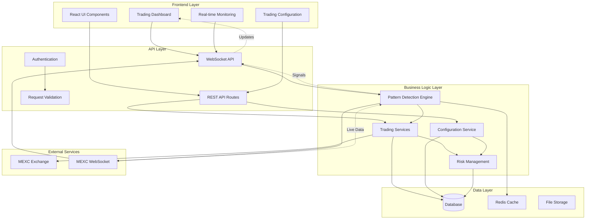
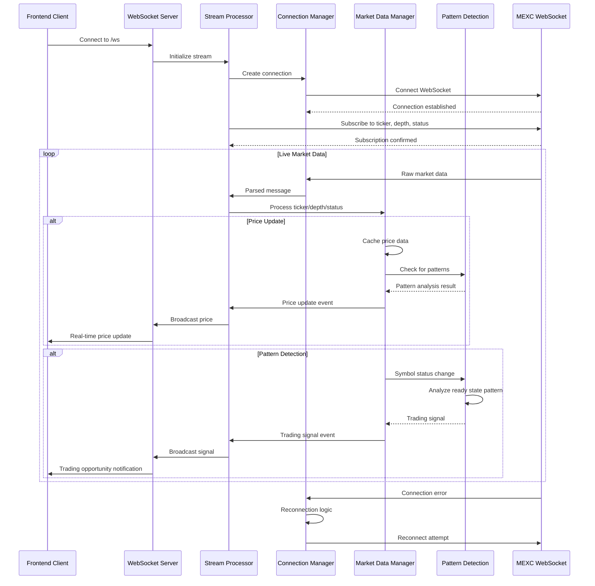
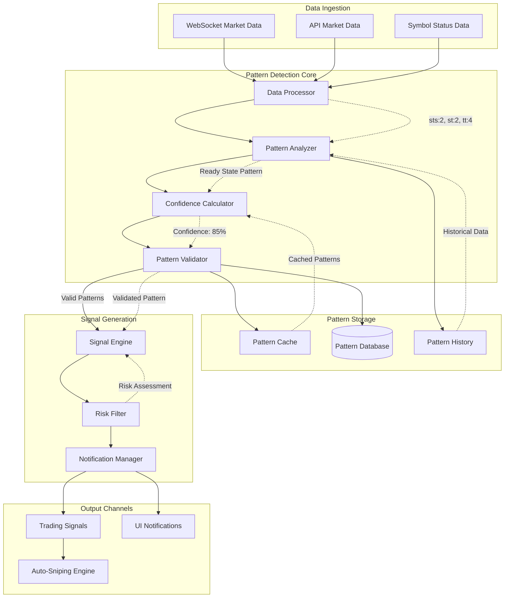
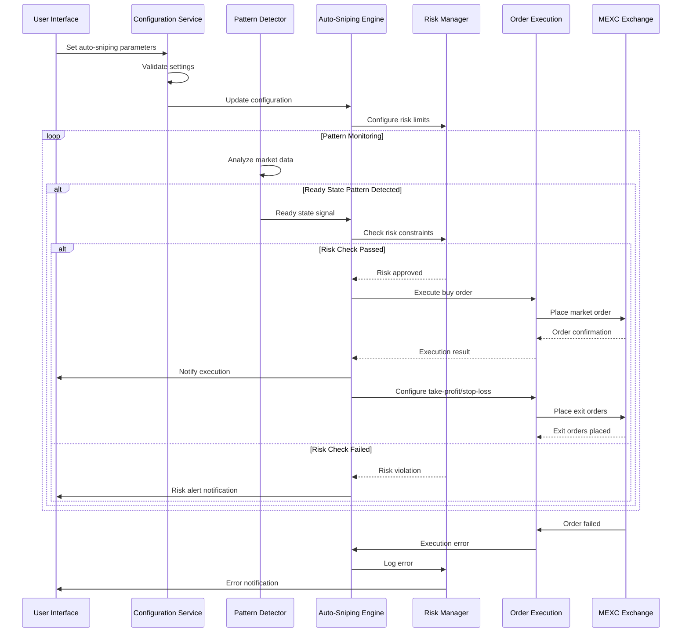
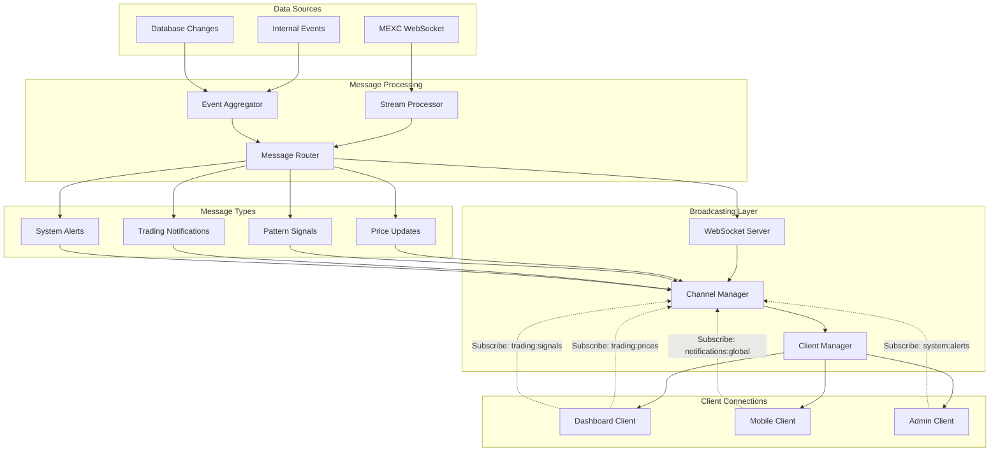

# MEXC Sniper Bot - Comprehensive Data Flow Diagrams

This document contains detailed mermaid diagrams mapping all data flows in the MEXC Sniper Bot system.

## 1. System Overview Data Flow



## 2. WebSocket Data Streams Flow



## 3. API Request/Response Flows

```mermaid
graph LR
    subgraph "Frontend Layer"
        Component[React Component]
        Hook[Custom Hook]
        Query[TanStack Query]
    end

    subgraph "API Routes"
        MarketAPI[/api/market-data/klines]
        TuningAPI[/api/tuning/optimization-history]
        AuthAPI[/api/auth/session]
        ConfigAPI[/api/trading-settings]
    end

    subgraph "Services Layer"
        MexcService[Unified MEXC Service]
        DBService[Database Service]
        CacheService[Cache Service]
        ValidationService[Validation Service]
    end

    subgraph "Data Sources"
        MexcExchange[MEXC Exchange API]
        Database[(PostgreSQL)]
        RedisCache[(Redis Cache)]
    end

    %% Frontend request flow
    Component --> Hook
    Hook --> Query
    Query -->|HTTP Request| MarketAPI
    Query -->|HTTP Request| TuningAPI
    Query -->|HTTP Request| AuthAPI
    Query -->|HTTP Request| ConfigAPI

    %% API processing flow
    MarketAPI --> ValidationService
    ValidationService --> MexcService
    MexcService --> MexcExchange
    MexcExchange -->|Market Data| MexcService
    MexcService --> CacheService
    CacheService --> RedisCache
    MexcService -->|Response| MarketAPI
    MarketAPI -->|JSON Response| Query

    %% Tuning API flow
    TuningAPI --> ValidationService
    ValidationService --> DBService
    DBService --> Database
    Database -->|Query Results| DBService
    DBService -->|Response| TuningAPI
    TuningAPI -->|JSON Response| Query

    %% Configuration flow
    ConfigAPI --> ValidationService
    ValidationService --> DBService
    DBService --> Database
    Database -->|Config Data| DBService
    DBService --> CacheService
    CacheService -->|Response| ConfigAPI
    ConfigAPI -->|JSON Response| Query

    %% Response handling
    Query -->|Data| Hook
    Hook -->|State Update| Component
    Component -->|Re-render| Component
```

## 4. Pattern Detection Data Flow



## 5. Frontend-Backend Data Mapping

```mermaid
graph TB
    subgraph "React Components"
        PDashboard[Parameter Optimization Dashboard]
        TradingConfig[Trading Configuration]
        Monitoring[Safety Monitoring]
        AccountBalance[Account Balance]
    end

    subgraph "Custom Hooks"
        useOptimization[useOptimization]
        usePatternMonitoring[usePatternMonitoring]
        useAccountBalance[useAccountBalance]
        useTradingSettings[useTradingSettings]
    end

    subgraph "API Endpoints"
        OptimizationAPI[/api/tuning/optimizations]
        PatternAPI[/api/pattern-detection]
        BalanceAPI[/api/account/balance]
        SettingsAPI[/api/trading-settings]
    end

    subgraph "Backend Services"
        OptimizationEngine[Parameter Optimization Engine]
        PatternDetectionService[Pattern Detection Service]
        MexcAccountService[MEXC Account Service]
        UserPreferencesService[User Preferences Service]
    end

    subgraph "Data Flow Types"
        OptimizationData[OptimizationRunData]
        PatternData[PatternAnalysisResult]
        BalanceData[AccountBalanceData]
        PreferencesData[UserTradingPreferences]
    end

    %% Component to hook connections
    PDashboard --> useOptimization
    TradingConfig --> useTradingSettings
    Monitoring --> usePatternMonitoring
    AccountBalance --> useAccountBalance

    %% Hook to API connections
    useOptimization --> OptimizationAPI
    usePatternMonitoring --> PatternAPI
    useAccountBalance --> BalanceAPI
    useTradingSettings --> SettingsAPI

    %% API to service connections
    OptimizationAPI --> OptimizationEngine
    PatternAPI --> PatternDetectionService
    BalanceAPI --> MexcAccountService
    SettingsAPI --> UserPreferencesService

    %% Data type flows
    OptimizationEngine --> OptimizationData
    PatternDetectionService --> PatternData
    MexcAccountService --> BalanceData
    UserPreferencesService --> PreferencesData

    %% Response flow back to frontend
    OptimizationData -.->|Real-time Updates| PDashboard
    PatternData -.->|Pattern Notifications| Monitoring
    BalanceData -.->|Balance Updates| AccountBalance
    PreferencesData -.->|Config Updates| TradingConfig
```

## 6. Auto-Sniping Execution Flow



## 7. Real-time Data Broadcasting Architecture



## Data Flow Summary

### Key Data Paths:
1. **Market Data Ingestion**: MEXC WebSocket → Stream Processor → Market Data Manager → Pattern Detection
2. **Pattern Detection**: Symbol Status → Pattern Analyzer → Confidence Calculator → Trading Signals
3. **Auto-Sniping**: Trading Signals → Risk Manager → Order Execution → MEXC Exchange
4. **Real-time Updates**: WebSocket Server → Channel Manager → Frontend Clients
5. **Configuration**: Frontend → API Routes → Database → Cache → Services
6. **Monitoring**: Backend Services → Database → API Routes → Frontend Dashboard

### Critical Integration Points:
- **WebSocket Bridge**: Connects MEXC data streams to internal pattern detection
- **Risk Manager**: Validates all trading decisions before execution
- **Pattern Detection Core**: Central hub for market analysis and signal generation
- **Configuration Service**: Manages user preferences and system settings
- **Real-time Broadcasting**: Distributes live updates to all connected clients

### Performance Considerations:
- **Caching Strategy**: Redis cache for frequent data access
- **Connection Pooling**: Optimized database connections
- **Circuit Breakers**: Automatic fallback for external service failures
- **Rate Limiting**: Prevents API overload and ensures compliance
- **Data Compression**: Efficient WebSocket message serialization